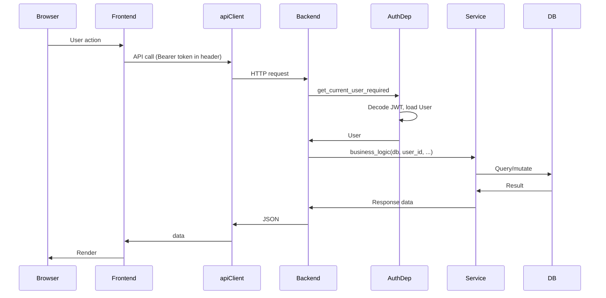

# Photowalker Architecture Foundations

**Version:** 1.0  
**Date:** 2026-02-05  
**Reference:** [PRD v2](./PRD_v2.md), [IMPLEMENTATION_ROADMAP](./IMPLEMENTATION_ROADMAP.md)

---

## 1. Executive Summary

Photowalker is a photo-route mapping application: users create routes (with PostGIS LineString geometry), attach photos, and discover public routes. **Stack:** FastAPI + PostgreSQL/PostGIS + Redis on the backend; React 18 + TypeScript + Vite on the frontend. **Current state:** Phases 0-2 complete (project foundation, backend core, full authentication flow).

---

## 2. Backend Architecture

### Core Layer ([backend/app/core/](../backend/app/core/))

| File | Purpose |
|------|---------|
| `config.py` | Pydantic `Settings` loaded from env; `get_settings()` cached via `lru_cache` |
| `factory.py` | `create_app(settings)` - CORS, error handlers, router registration, DB pool startup/shutdown |
| `logging.py` | Structured logging by environment |

### Data Layer ([backend/app/db/](../backend/app/db/), [backend/app/models/](../backend/app/models/))

- **Session:** Async SQLAlchemy; `get_db` yields `AsyncSession`, auto-commits on success, rollback on error
- **Models:** `User`, `Route`, `Photo`, `Tag`, `RoutePhoto`, `RouteTag` - relationships defined; PostGIS LineString for `route_geometry`
- **Migrations:** Alembic; `001_initial_schema` creates tables, indexes, PostGIS extension

### Auth Layer ([backend/app/auth/](../backend/app/auth/), [backend/app/services/auth_service.py](../backend/app/services/auth_service.py))

- **Flow:** Google OAuth code exchange; JWT access token (15 min) + refresh token (7 days, HTTP-only cookie)
- **Dependencies:** `get_current_user` (optional, returns `User | None`) and `get_current_user_required` (raises 401 if unauthenticated)
- **Service:** `exchange_code_for_user`, `create_or_get_user`, `issue_tokens`, `refresh_tokens`, `get_user_by_id`

### API Pattern ([backend/app/api/v1/](../backend/app/api/v1/))

- **Routers:** `health`, `auth` (prefix `/v1/auth`)
- **Endpoints:** `POST /google`, `POST /refresh`, `POST /logout`, `GET /me`
- **Error format:** `{ "error": { "code", "message", "details" } }` - see [error_handler.py](../backend/app/middleware/error_handler.py)

### Supporting ([backend/app/storage/s3.py](../backend/app/storage/s3.py))

- S3 connectivity check for health endpoint; placeholder for photo upload logic

---

## 3. Frontend Architecture

### API Client ([frontend/src/api/client.ts](../frontend/src/api/client.ts))

- Axios instance: dev uses relative URL (Vite proxy), prod uses `VITE_API_URL`
- `withCredentials: true` for cookie inclusion
- **Request:** Injects `Authorization: Bearer {token}` when `authStore.accessToken` is set
- **Response:** 401 interceptor triggers refresh, retries original request, or redirects to `/login` on failure

### Auth Flow ([frontend/src/api/auth.ts](../frontend/src/api/auth.ts), [authStore](../frontend/src/store/authStore.ts), [useAuth](../frontend/src/hooks/useAuth.ts))

- **Store:** Zustand - `user`, `accessToken`, `loading`, `clearUser`
- **useAuth:** Session init on mount (refresh + getMe); `login` redirects to Google; `logout` calls API and clears store
- **Callback:** `/auth/callback` exchanges code via `loginWithCode`, stores tokens and user in authStore

### Routing ([frontend/src/App.tsx](../frontend/src/App.tsx))

- React Router: `/`, `/login`, `/auth/callback`
- Nav: Home link; Sign in / Sign out; shows user name when authenticated

### Scaffolding (not yet wired)

- `api/routes.ts`, `api/photos.ts` - placeholders
- Components: `MapView`, `RouteForm`, `RouteList`, `RouteView`, etc. - structure present, awaiting API integration

---

## 4. Infrastructure

- **Docker Compose:** Postgres 15 + PostGIS 3.3, Redis 7
- **Vite proxy:** `/v1`, `/health` -> `http://localhost:8000` (same-origin for cookies)
- **CI:** GitHub Actions for lint and test

---

## 5. How to Add Business Logic

### Backend - New Feature

1. **Schemas:** Add request/response Pydantic models in `app/schemas/`
2. **Service:** Implement logic in `app/services/` (e.g. `route_service.py`) - CRUD, validation, ownership checks
3. **Router:** Create `app/api/v1/{feature}.py`; use `Depends(get_current_user_required)` for protected endpoints, `Depends(get_db)` for DB access
4. **Factory:** Register router in `app/core/factory.py` via `app.include_router()`
5. **Errors:** Raise `HTTPException` with `detail={"code": "...", "message": "...", "details": ...}` for consistency

### Frontend - New Feature

1. **Types:** Add interfaces in `frontend/src/types/`
2. **API:** Add functions in `frontend/src/api/` using `apiClient`; Bearer token injection is automatic
3. **Hook:** Create `use{Foo}` hook that calls API, manages loading/error state
4. **Page/Component:** Use hook, render UI; add route in `App.tsx` if needed

### Data Changes

- Create Alembic migration: `alembic revision -m "add_foo"`; implement `upgrade()` and `downgrade()`
- Update models in `app/models/` to match schema

---

## 6. Key Conventions

| Area | Convention |
|------|------------|
| **Auth** | Protected endpoints use `get_current_user_required`; optional auth uses `get_current_user` |
| **DB** | Use async `AsyncSession`; keep business logic in services, not routers |
| **Frontend** | All API calls via `apiClient`; auth state in `authStore`; 401 handling is automatic |
| **Design** | [PRD v2](./PRD_v2.md) and [IMPLEMENTATION_ROADMAP](./IMPLEMENTATION_ROADMAP.md) are the design authority |

---

## 7. Request Flow (Auth Protected)

