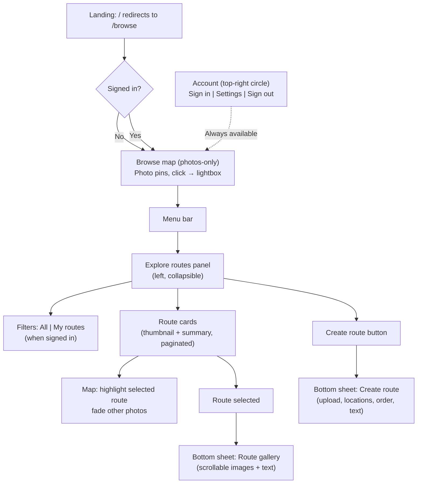

# Photowalker Product Requirements Document

Single source of truth for the Photowalker product. Reflects the actual implemented state of the codebase as of 2026-04-12 (verified against codebase review `docs/plans/2026-03-06-codebase-review-report.md`). Unimplemented features are listed separately in [Section 8 — Planned but Not Yet Implemented](#8-planned-but-not-yet-implemented).

Previous version archived at [design/history/PRD_v7.md](history/PRD_v7.md).

---

## Table of Contents

1. [Project Specifics](#1-project-specifics)
2. [Team Goals and Business Objectives](#2-team-goals-and-business-objectives)
3. [Background and Strategic Fit](#3-background-and-strategic-fit)
4. [Assumptions](#4-assumptions)
5. [User Stories and Requirements](#5-user-stories-and-requirements)
6. [User Interaction and Design](#6-user-interaction-and-design)
7. [Technical Specification](#7-technical-specification)
8. [Planned but Not Yet Implemented](#8-planned-but-not-yet-implemented)
9. [Known Gaps and Issues](#9-known-gaps-and-issues)
10. [Out of Scope](#10-out-of-scope)
11. [Open Questions](#11-open-questions)
12. [UAT Verification](#12-uat-verification)
13. [References](#13-references)

---

## 1. Project Specifics

| Field | Value |
|-------|-------|
| **Participants** | Product owner, development team, stakeholders |
| **Status** | Beta — core flows complete; several planned features outstanding |
| **Target Release** | Beta / production launch |
| **Primary Document** | This PRD (single source of truth) |
| **Last verified** | 2026-04-12 (see codebase review report) |

---

## 2. Team Goals and Business Objectives

### Problem

Instagram has become less engaging for photographers. The real community in photography is found in photowalks—organized walks where photographers explore locations together and share stories through pictures. There is no dedicated platform that combines route planning, geolocated photos, and community discovery in one place.

### Solution

Photowalker is a web application that enables photographers to create, share, and discover photowalk routes with geolocated photos. It combines route planning (hiking-app style) with photo sharing (Instagram-style), designed specifically for photographers.

**Core Concept:** Each photowalk is a "living object" that combines:
- A curated route (the path walked)
- Photos taken at specific locations along that route
- Narrative and context

### Goals

- Enable photographers to create and share photowalk routes with geolocated photos
- Provide a map-first discovery experience for browsing routes and photos by location
- Build a community-driven library of discoverable photowalk experiences
- Achieve product-market fit before exploring monetization

### Success Criteria

- Users can successfully create and share photowalk routes
- Photos are correctly geolocated and displayed on maps
- Public routes are discoverable through browsing
- Core flow (create, upload, share, view) works smoothly
- Initial user feedback is positive

### Success Metrics

| Category | Metrics |
|----------|---------|
| User Engagement | Routes created, photos uploaded, route views, average photos per route |
| Platform Health | User retention, route discovery, geographic coverage |
| Technical | API p95 <200ms, map load <2s, thumbnail load <500ms |

---

## 3. Background and Strategic Fit

### Target Users

**Primary:** Photographers who participate in or organize photowalks (street, landscape, urban, enthusiasts)

**Secondary:** Anyone interested in discovering interesting routes and visual stories

### What Makes Photowalker Different

1. **Geographic Focus:** Routes and photos are tied to real-world locations, enabling discovery by place
2. **Route-Centric:** Unlike Instagram (photo-centric) or Strava (activity-centric), Photowalker centers on the route as the primary object
3. **Photo Reuse:** Photos can belong to multiple routes, enabling creative storytelling
4. **Community Discovery:** Public routes create a discoverable library of photowalk experiences

### Technical Approach

- **Backend:** FastAPI (Python) API with PostgreSQL + PostGIS, AWS S3 for photo storage
- **Frontend:** React + TypeScript, MapLibre GL JS, Vite
- **Auth:** Google OAuth only
- **Deployment:** Docker, documented in [docs/DEPLOYMENT.md](../docs/DEPLOYMENT.md)

---

## 4. Assumptions

### Technical Assumptions

- JPEG is the only supported format for now
- Photos may or may not have GPS metadata (EXIF); if EXIF GPS is missing, photos are still accepted but must be manually placed on the map before publishing a route
- Maximum 50 photos per route; maximum 10MB per photo
- PostGIS for efficient spatial queries; WGS84 (EPSG:4326) for all geometries
- Web-first approach is sufficient for initial launch

### Business Assumptions

- Photographers want to share routes and discover new locations
- Community will create valuable content organically
- Geographic discovery is a key differentiator
- Map-first UI will support future mobile adaptation

### Design Assumptions

- Shared understanding of the target customer between product, design, and development
- Layout and components should be structured for future mobile conversion without redefining flows
- Bottom drawer and collapsible panel patterns work across desktop and future mobile

---

## 5. User Stories and Requirements

### 5.1 Authentication and Accounts (FR1)

**User Story:** As a user, I can sign in with Google OAuth.

**Acceptance Criteria:**
- One-click Google sign-in; JWT issued; session persists via refresh token
- Sign out clears the refresh token cookie (note: server-side token revocation is not yet implemented — see [Section 9](#9-known-gaps-and-issues))
- Edge cases: existing account logs in; OAuth failure shows error; token refresh failure redirects to login

**Implemented:** Google OAuth exchange, JWT (15 min), HTTP-only refresh cookie (7 days), `/auth/me`, `/auth/refresh`, `/auth/logout` (cookie clear only)

### 5.2 Route Creation (FR2)

**User Story:** As a user, I can create a photowalk route, primarily from photos, and optionally by drawing.

**Acceptance Criteria:**
- Upload photos (with or without GPS)
- For photos without GPS: place each on the map (MapPicker) before publishing
- Adjust order (drag-and-drop), connect photos on the map, add title/description/tags
- Create route via `POST /v1/routes/from-photos` with ordered `photo_ids`
- Backend derives route LineString geometry from photo locations and computes distance
- System validates: at least 2 photo points with locations, distance >0, title 1–100 chars, ≤5 tags
- Routes are private by default; publishing makes them public

**Implemented:** Complete.

### 5.3 Photo Upload and Association (FR3)

**User Story:** As a user, I can upload photos and attach them to routes.

**Acceptance Criteria:**
- JPEG upload (max 10MB, max 50 per route); EXIF GPS used when present
- If EXIF GPS is missing, the photo is still accepted; `photos.location` is stored as `NULL` until the user places the photo on the map
- Thumbnail generated asynchronously (RQ worker); photo stored in S3
- Photos can be associated with one or more routes

**Implemented:** All of the above.

### 5.4 Route Viewing (FR4)

**User Story:** As a visitor, I can view a shared route via public URL.

**Acceptance Criteria:**
- Route at `/routes/{slug}`; map with polyline and photo pins; gallery with lightbox
- Metadata: title, description, author, date, distance, tags
- Invalid slug → 404; private route → 403 unless owner

**Implemented:** All of the above.

### 5.5 Route Browsing and Discovery (FR5)

**User Story:** As a visitor, I can browse public routes and photos on the map.

**Acceptance Criteria:**
- Browse page with map; bbox-based queries; filter by tags, author
- Photo pins in viewport (from `GET /v1/photos?bbox=`)
- Paginated route list; sort by date or distance

**Implemented:** All of the above.

---

### 5.6 Advanced Route & Photo Workflows (Implemented)

#### Photo-first Route Creation (FR-R1)

**User Story:** As a user, I can create a route by uploading photos and connecting them on a map.

**Key Behaviour:**
- Primary entry: "Create route from photos"
- Upload one or more JPEGs (max 50)
- Photos with EXIF GPS are plotted automatically; photos without GPS must be placed on the map before publishing
- Points are initially ordered by `captured_at` (or upload order if missing)
- User can reorder photos (drag-and-drop) and provide title, description, tags, and visibility
- Backend validates at least 2 photos with locations; builds LineString geometry; computes distance

**Implemented:** Complete.

#### Route–Photo Geometry Consistency (FR-R2)

**User Story:** As a user, I expect routes to always reflect the photos they contain.

**Key Behaviour:**
- Route geometry is always derived from the ordered set of route photos
- `routes.route_geometry` is computed from photo locations in `display_order`
- A published route must have at least 2 photos with locations

**Implemented:** Complete.

#### Photos Without Location & Location Editing (FR-R3)

**User Story:** As a user, I can upload photos without GPS and place them on the map, and I can edit photo locations later.

**Key Behaviour:**
- `photos.location` is nullable; uploads without EXIF GPS are stored with `location = NULL`
- UI surfaces a "Place on map" flow for photos without locations
- `PATCH /v1/photos/{id}` supports updating `location` (Point or `null`)
- Editing a photo's location that belongs to a route triggers route geometry recomputation
- Publishing a route enforces that all route photos have locations

**Implemented:** Complete.

#### Thumbnail Pins (FR-R4)

**User Story:** As a user, I see photo thumbnails as map pins.

**Key Behaviour:**
- Photo pins render thumbnails (~40–48px) when available, with a fallback dot while thumbnail generation is pending
- Nearby photos are clustered at low zoom with stacked thumbnail display

**Implemented:** Thumbnail pins and stacking are complete. Cluster count badge is not yet rendered (see [Section 9](#9-known-gaps-and-issues)).

---

### 5.7 Map & UI/UX Requirements (Implemented)

#### Map-first Layout and Shell

**User Story:** As a user, the map is always the primary canvas; other UI appears as overlays.

**Key Behaviour:**
- A single `MapShell` renders one full-viewport MapLibre map (100vw × 100vh minus minimal chrome)
- `MapShell` manages modes: `home`, `browse-photos`, `detail`, `create`, `browse`
- Overlays appear on top of the map; URL drives state

| Pathname | Mode |
|----------|------|
| `/` | `home` |
| `/browse` | `browse-photos` |
| `/routes/create` | `create` |
| `/routes/:slug` | `detail` |

**Implemented:** Complete. (Note: `explore-route-highlight` mode described in older PRD versions is not in the `MapShellMode` type; route highlighting is handled within the `browse-photos` mode.)

#### Explore Panel, Bottom Drawer, and Account UI (FR-U1–FR-U7)

| ID | User Story | Status |
|----|------------|--------|
| FR-U1 | `/` redirects to `/browse`; dismissible welcome modal (sessionStorage) | ✓ Implemented |
| FR-U2 | Photos-only default browse; photo lightbox (photo, user, routes) | ✓ Implemented |
| FR-U3 | Explore routes panel — All/My filter, route cards, Create route button, hover highlights route on map | ✓ Implemented |
| FR-U4 | Bottom drawer for route view and create — peek + expand | ✓ Implemented |
| FR-U5 | Account in top-right only — Sign in, Settings, Sign out | ✓ Implemented |
| FR-U6 | My routes as filter only — no `/routes/me` page | ✓ Implemented (backend `GET /v1/routes/me` exists but no frontend page) |
| FR-U7 | Mobile-ready structure — rem/%, touch targets ≥44px | ✓ Mostly implemented (AccountIcon touch target is 40px — see [Section 9](#9-known-gaps-and-issues)) |

#### Basemap Styling

- Vector basemap via OpenFreeMap (no API key required)
- Warm, photography-friendly palette (prettymaps-like)
- App layers (routes, clusters, photo markers) render above basemap layers

---

### 5.8 Non-Functional Requirements

| ID | Area | Requirement | Status |
|----|------|-------------|--------|
| NFR1 | Performance | Map load <2s; thumbnail <500ms; API p95 <200ms | Target |
| NFR2 | Storage | 100 routes/user; 50 photos/route; 10MB/photo; 5GB total/user (soft) | Enforced at upload |
| NFR3 | Rate limiting | 100 req/min (anonymous); 500 req/min (auth); 10 uploads/min | ✓ Implemented (in-memory, per-process) |
| NFR4 | Security | JWT 15min; refresh 7 days HTTP-only; HTTPS; CORS for frontend | ✓ Partial (no server-side revocation — see Section 9) |
| NFR5 | Testing | ≥80% unit coverage; integration for all endpoints; E2E for critical flows | ⚠ Coverage gaps exist (see codebase review) |

---

## 6. User Interaction and Design

### Design Principles

- **Map-first:** The map is the primary surface; overlays and panels support it
- **Collapsible panels:** Route list in left collapsible panel, not default view
- **Bottom drawer:** Route view and create use same bottom-drawer pattern
- **Account top-right:** Identity and settings behind circular user icon only
- **Mobile-ready:** Components structured for future mobile conversion

### Routing

- `/` redirects to `/browse`
- `/browse` — photos on map; welcome modal when unauthenticated
- `/routes/:slug` — route detail in bottom drawer
- `/routes/create` — create flow in bottom drawer (protected)
- No `/routes/me` page; My routes is a filter in Explore panel

### Navigation

- **Menu bar (left):** Browse, Routes (opens Explore panel)
- **Account (top-right):** Sign in, Settings, Sign out only
- **Explore panel:** All | My routes filter; route cards; Create route button
- **Bottom drawer:** Route gallery or create form; peek and expanded states

### Core Flows

1. **First impression:** Land on /browse; welcome modal if not signed in; dismissible via sessionStorage
2. **Browse:** Map shows photo pins in viewport bbox; click opens PhotoGallery lightbox with photo, user, routes
3. **Explore routes:** Open panel from menu; filter All/My routes; hover/select highlights route on map; click opens route in drawer
4. **View route:** Bottom drawer with gallery, metadata, owner actions (edit photo location)
5. **Create route:** Create button in panel only; drawer with upload → place → reorder → details → `POST /v1/routes/from-photos`

### Flow Diagram



### Map Modes

| Mode | Context | Map Content |
|------|---------|-------------|
| `home` | `/` (redirects immediately) | n/a |
| `browse-photos` | `/browse` | Photo pins in viewport bbox; route highlight when panel route hovered |
| `detail` | `/routes/:slug` | Route polyline + photo pins for that route |
| `create` | `/routes/create` | Preview line and markers during route drawing/building |

---

## 7. Technical Specification

### Database Schema

- **users:** id, google_id, email, name, avatar_url, default_map_lat, default_map_lon
- **routes:** id, user_id, slug, title, description, route_geometry (LineString), distance_meters, is_public, is_draft (column exists; no API surface yet — see Section 8)
- **photos:** id, user_id, s3_key_original, s3_key_thumbnail, location (Point, nullable), caption, exif_data, captured_at
- **route_photos:** route_id, photo_id, display_order (many-to-many join)
- **tags, route_tags:** Tagging for routes

All geometries use PostGIS with SRID 4326 (WGS84). GIST indexes on geometries for bbox queries.

### API

Base path: `/v1/`

| Method | Endpoint | Auth | Purpose |
|--------|----------|------|---------|
| POST | /auth/google | — | Exchange Google code for JWT + refresh cookie |
| POST | /auth/refresh | — | Refresh access token via cookie |
| POST | /auth/logout | — | Clear refresh token cookie |
| GET | /auth/me | Required | Current user |
| PATCH | /auth/me | Required | Update user (name, default_map_location) |
| GET | /routes | — | Browse public routes (bbox, tags, author_id, page, per_page, sort) |
| POST | /routes/from-photos | Required | Create route from ordered photo list |
| GET | /routes/me | Required | Current user's routes |
| GET | /routes/{slug} | Optional | Route detail with photos (public or owner) |
| GET | /routes/{route_id}/photos | Optional | Photos for a route (ordered) |
| PUT | /routes/{route_id}/photos/order | Required | Reorder photos in a route (owner only) |
| PATCH | /routes/{route_id} | Required | Update route title/description/tags/visibility |
| DELETE | /routes/{route_id} | Required | Delete route (owner only) |
| GET | /photos | — | Photos in bbox (map browse pins) |
| POST | /photos | Required | Upload photo (multipart, JPEG, max 10MB) |
| GET | /photos/my | Required | Current user's photos |
| PATCH | /photos/{photo_id} | Required | Update caption, location, or route associations |
| DELETE | /photos/{photo_id} | Required | Delete photo globally (owner only) |
| GET | /photos/{photo_id}/image | Optional | Photo image (original or thumbnail variant) |
| GET | /health | — | Application health check |
| GET | /health/db | — | Database connectivity check |
| GET | /health/storage | — | S3 storage connectivity check |

Full contract: [shared/openapi.yaml](../shared/openapi.yaml) (canonical at `/openapi.json` when running).

### Key Components

| Component | Purpose |
|-----------|---------|
| `MapShell` | Root map layout; mode: `home`, `browse-photos`, `detail`, `create` |
| `MapView` | MapLibre GL canvas mount and style load |
| `ExploreRoutesPanel` | Left collapsible panel; All/My filter, route list, Create button |
| `BottomDrawer` | Shared peek/expand drawer for route view and create |
| `PhotoGallery` | Lightbox for single or multiple photos (browse and route detail) |
| `PhotoUploadForm` | File input, caption, upload progress, EXIF preview |
| `AccountIcon` | Top-right circular user icon with dropdown |
| `RouteDrawer` | MapLibre GL Draw wrapper for polyline drawing |
| `MapPicker` | Single-point coordinate picker for placing unlocated photos |
| `HighlightedRouteLayer` | Renders highlighted route polyline on map |
| `PhotoMarker` | Thumbnail pin marker element |

### Project Structure

```
photowalker-app/
├── backend/          # FastAPI, services, models, auth, storage
├── frontend/         # React, pages, components, map
├── shared/           # openapi.yaml
├── design/           # PRD (this file) and design history
└── docs/             # DEVELOPMENT, DEPLOYMENT, TROUBLESHOOTING
```

---

## 8. Planned but Not Yet Implemented

These features are in the PRD backlog but have no implementation in the current codebase.

### Bulk Reorder & Add/Remove Photos on Existing Routes (FR-R5, FR-R6)

- `PUT /v1/routes/{route_id}/photos/order` — **backend implemented**; no frontend UI yet
- `DELETE /v1/routes/{route_id}/photos/{photo_id}` — remove a photo from a route without deleting it globally (backend and frontend both absent)
- Frontend photo management panel for the route detail/edit view
- Guard: published route must maintain ≥2 photos with locations

### GPX Export (FR-R7)

- `GET /v1/routes/{slug}/gpx` returning `application/gpx+xml` with track + photo waypoints
- Export button in route detail view
- Filename: `{route-slug}.gpx`; compatible with Google Maps and standard GPS apps

### Undo/Redo in Create Flow (FR-R9)

- Undo/redo stack over the `photos` state array in `CreateRouteFromPhotos`
- Keyboard shortcuts: Ctrl+Z / Cmd+Z (undo), Ctrl+Shift+Z / Cmd+Shift+Z (redo)
- History limited to ~20 actions

### Route Drafts (FR-R10)

- `is_draft` column exists in the DB model and migration but has no API surface
- Endpoints needed: `POST /v1/drafts`, `GET /v1/drafts`, `PATCH /v1/drafts/{id}/publish`, `DELETE /v1/drafts/{id}`
- Frontend draft save/list/publish flow
- Drafts are owner-only and excluded from public browse

---

## 9. Known Gaps and Issues

Issues confirmed in codebase review. Grouped by severity.

### Security (P0)

| Issue | Location | Detail |
|-------|----------|--------|
| `SECRET_KEY` has no min-length validation | `core/config.py:26` | A weak key makes all JWTs forgeable. Should reject keys <32 chars or known placeholders. |
| Health endpoints leak internal error strings | `api/v1/health.py:32-54` | `"error": str(e)` in 503 body can expose DB hostnames, S3 ARNs. Should log server-side only. |

### Security (P1)

| Issue | Location | Detail |
|-------|----------|--------|
| Logout does not server-side invalidate refresh token | `api/v1/auth.py:163-171` | Stolen refresh token remains valid for 7 days post-logout. |
| `test-login` endpoint always registered in OpenAPI | `api/v1/auth.py:80-116` | Should only be included when `e2e_test_secret` is set. |
| Refresh cookie `secure=False` in non-production | `api/v1/auth.py:72` | Staging sends refresh token over plain HTTP. |
| `X-Forwarded-For` uses rightmost IP | `middleware/rate_limit.py:76-82` | Behind a load balancer, all users share one rate-limit bucket. Should use `split(",")[0].strip()`. |

### Functionality (P1)

| Issue | Location | Detail |
|-------|----------|--------|
| `initPromise` persists across logout/re-login | `hooks/useAuth.ts:6` | After logout + re-login in same session, session re-init is skipped. |
| Cluster count badge not rendered | `pages/Browse.tsx` | Photo clusters show stacked thumbnails but no numeric count. |

### UI/Accessibility (P2)

| Issue | Location | Detail |
|-------|----------|--------|
| `AccountIcon` touch target is 40px | `components/common/AccountIcon.tsx:42-56` | PRD requires ≥44px (WCAG 2.1). |
| Cluster markers `aria-hidden` but interactive | `pages/Browse.tsx:124` | WCAG failure — inaccessible to keyboard/screen reader users. |
| Drag-and-drop reorder no keyboard alternative | `pages/CreateRouteFromPhotos.tsx:554-558` | WCAG 2.1 SC 2.1.1 failure. |
| `Settings.tsx` is a placeholder stub | `pages/Settings.tsx` | Reachable from account dropdown; shows "coming soon" only. |

### Code Quality (P2)

| Issue | Location | Detail |
|-------|----------|--------|
| `@app.on_event` deprecated | `core/factory.py:42-54` | Migrate to `@asynccontextmanager` lifespan. |
| `ErrorBoundary` renders raw stack trace in production | `components/common/ErrorBoundary.tsx:44-49` | Guard `<details>` block with `NODE_ENV === 'development'`. |
| `Browse.tsx` is 958 lines | `pages/Browse.tsx` | Mixes API fetching, map layer management, cluster DOM, blob loading, and lightbox state. |

---

## 10. Out of Scope

The following are explicitly not in the current or planned release:

### User Features
- User profiles beyond name + avatar
- Following, comments, likes, collections

### Route Features
- Collaborative editing, versioning, templates
- Social sharing beyond public URL

### Photo Features
- Photo editing, RAW/PNG, video

### Discovery
- Filter/sort chips, search in panel, share button, save/bookmark
- Offline mode, recommendations, trending

### Technical
- Native mobile apps
- PWA / offline
- WebSocket, real-time collaboration
- Monetization features

---

## 11. Open Questions

| Question | Owner | Notes |
|----------|-------|-------|
| CDN for photo delivery | Infrastructure | S3 direct vs CloudFront |
| Analytics integration | Product | Post-launch |
| Monetization strategy | Business | After product-market fit |
| Server-side token revocation | Backend | Redis blocklist or revocation table required |
| Redis in production | Infrastructure | In-memory rate limiting is per-process; multi-worker requires Redis |

---

## 12. UAT Verification

Manual verification before release. Sign-off indicates all criteria pass.

| ID | Requirement | Verification |
|----|-------------|--------------|
| UAT-U1 | Root redirects to browse | Navigate to `/` → redirect to `/browse` |
| UAT-U2 | Welcome modal on browse when not signed in | Modal with Browse the map, Create account; dismiss → not shown again in session |
| UAT-U3 | Account in top-right only | Sign in, Settings, Sign out only; no My routes or Create route in dropdown |
| UAT-U4 | Nav: Browse, Routes | Drawer menu has Browse and Routes; Routes opens panel |
| UAT-U5 | Browse default: photo pins; click → lightbox | Photo pins in viewport; pin click opens PhotoGallery lightbox |
| UAT-U6 | Explore panel: filters, cards, Create | All/My routes filter; paginated list; Create route opens drawer or login redirect |
| UAT-U7 | Panel collapse to icon strip | Collapse → narrow strip; expand → full panel |
| UAT-U8 | Route card hover/select highlights on map | That route's photos highlighted, others faded |
| UAT-U9 | Route card click opens drawer | Drawer with route gallery and metadata; map shows route |
| UAT-U10 | Create route only from panel | Create button in panel only; drawer has upload, place, reorder, submit |
| UAT-U11 | My routes only as filter | No /routes/me route; My routes only in panel filter |
| UAT-U12 | Touch and accessibility | Tap highlights; Escape and focus behaviour |
| UAT-C1 | Photo-first creation end-to-end | Upload JPEG with GPS → auto-plotted → reorder → title/tags → publish → route visible in browse |
| UAT-C2 | Photo without GPS | Upload JPEG without GPS → "Place on map" flow → pin placed → route publishable |
| UAT-C3 | Route detail | Navigate to `/routes/:slug` → polyline + photo pins on map → gallery in drawer |
| UAT-C4 | Auth round-trip | Sign in with Google → session persists on reload → sign out → session cleared |

**Sign-off:** _________________________ Date: ___________

---

## 13. References

| Document | Purpose |
|----------|---------|
| [docs/DEVELOPMENT.md](../docs/DEVELOPMENT.md) | Local setup, make targets, tests |
| [docs/DEPLOYMENT.md](../docs/DEPLOYMENT.md) | Docker, production deployment |
| [docs/TROUBLESHOOTING.md](../docs/TROUBLESHOOTING.md) | Common issues |
| [shared/openapi.yaml](../shared/openapi.yaml) | API contract (canonical at /openapi.json when running) |
| [CONTRIBUTING.md](../CONTRIBUTING.md) | Workflow, branching, PR process |
| [design/history/PRD_v7.md](history/PRD_v7.md) | Previous PRD (aspirational, pre-codebase-review) |
| [docs/plans/2026-03-06-codebase-review-report.md](../docs/plans/2026-03-06-codebase-review-report.md) | Full codebase review this document is based on |
