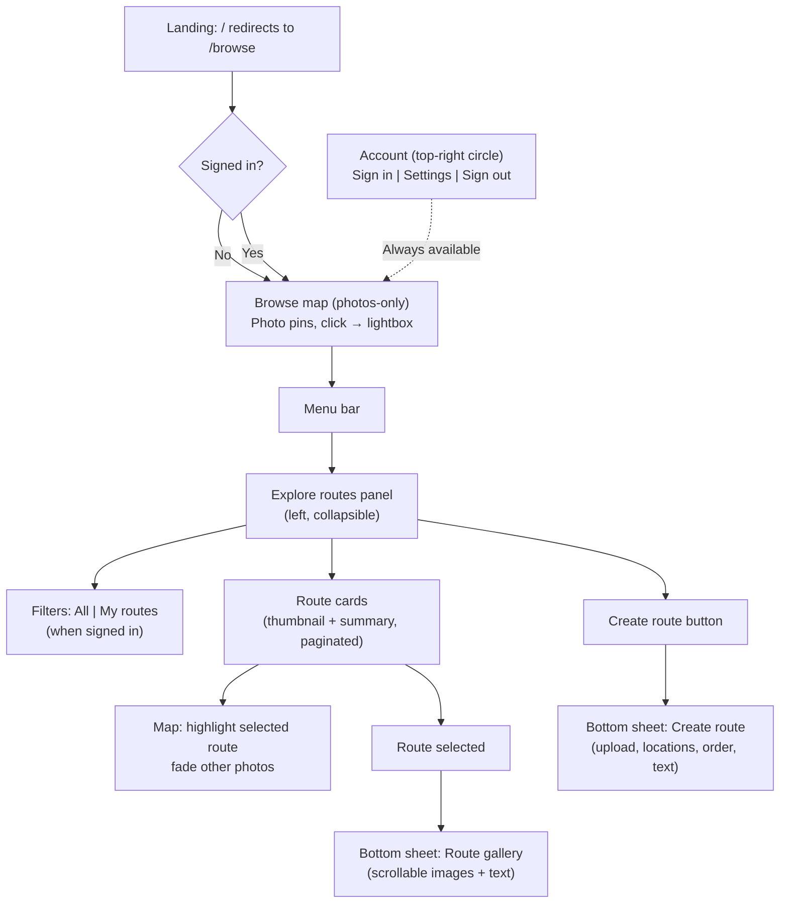

# Photowalker Product Requirements Document

Single source of truth for the Photowalker product. Combines business context, user flows, functional requirements, and technical specification.

---

## Table of Contents

1. [Project Specifics](#1-project-specifics)
2. [Team Goals and Business Objectives](#2-team-goals-and-business-objectives)
3. [Background and Strategic Fit](#3-background-and-strategic-fit)
4. [Assumptions](#4-assumptions)
5. [User Stories and Requirements](#5-user-stories-and-requirements)
6. [User Interaction and Design](#6-user-interaction-and-design)
7. [Technical Specification](#7-technical-specification)
8. [Out of Scope](#8-out-of-scope)
9. [Open Questions](#9-open-questions)
10. [UAT Verification](#10-uat-verification)
11. [References](#11-references)

---

## 1. Project Specifics

| Field | Value |
|-------|-------|
| **Participants** | Product owner, development team, stakeholders |
| **Status** | Release-ready |
| **Target Release** | Beta / production launch |
| **Primary Document** | This PRD (single source of truth) |

---

## 2. Team Goals and Business Objectives

### Problem

Instagram has become less engaging for photographers. The real community in photography is found in photowalks—organized walks where photographers explore locations together and share stories through pictures. There is no dedicated platform that combines route planning, geolocated photos, and community discovery in one place.

### Solution

Photowalker is a web application that enables photographers to create, share, and discover photowalk routes with geolocated photos. It combines route planning (hiking-app style) with photo sharing (Instagram-style), designed specifically for photographers.

**Core Concept:** Each photowalk is a "living object" that combines:
- A curated route (the path walked)
- Photos taken at specific locations along that route
- Narrative and context

### Goals

- Enable photographers to create and share photowalk routes with geolocated photos
- Provide a map-first discovery experience for browsing routes and photos by location
- Build a community-driven library of discoverable photowalk experiences
- Achieve product-market fit before exploring monetization

### Success Criteria

- Users can successfully create and share photowalk routes
- Photos are correctly geolocated and displayed on maps
- Public routes are discoverable through browsing
- Core flow (create, upload, share, view) works smoothly
- Initial user feedback is positive

### Success Metrics

| Category | Metrics |
|----------|---------|
| User Engagement | Routes created, photos uploaded, route views, average photos per route |
| Platform Health | User retention, route discovery, geographic coverage |
| Technical | API p95 &lt;200ms, map load &lt;2s, thumbnail load &lt;500ms |

---

## 3. Background and Strategic Fit

### Target Users

**Primary:** Photographers who participate in or organize photowalks (street, landscape, urban, enthusiasts)

**Secondary:** Anyone interested in discovering interesting routes and visual stories

### What Makes Photowalker Different

1. **Geographic Focus:** Routes and photos are tied to real-world locations, enabling discovery by place
2. **Route-Centric:** Unlike Instagram (photo-centric) or Strava (activity-centric), Photowalker centers on the route as the primary object
3. **Photo Reuse:** Photos can belong to multiple routes, enabling creative storytelling
4. **Community Discovery:** Public routes create a discoverable library of photowalk experiences

### Technical Approach

- **Backend:** FastAPI (Python) API with PostgreSQL + PostGIS, AWS S3 for photo storage
- **Frontend:** React + TypeScript, MapLibre GL JS, Vite
- **Auth:** Google OAuth only
- **Deployment:** Docker, documented in [docs/DEPLOYMENT.md](../docs/DEPLOYMENT.md)

---

## 4. Assumptions

### Technical Assumptions

- JPEG is the only supported format for now
- Photos may or may not have GPS metadata (EXIF); if EXIF GPS is missing, photos are still accepted but must be manually placed on the map before publishing a route
- Maximum 50 photos per route; maximum 10MB per photo
- PostGIS for efficient spatial queries; WGS84 (EPSG:4326) for all geometries
- Web-first approach is sufficient for initial launch

### Business Assumptions

- Photographers want to share routes and discover new locations
- Community will create valuable content organically
- Geographic discovery is a key differentiator
- Map-first UI will support future mobile adaptation

### Design Assumptions

- Shared understanding of the target customer between product, design, and development
- Layout and components should be structured for future mobile conversion without redefining flows
- Bottom drawer and collapsible panel patterns work across desktop and future mobile

---

## 5. User Stories and Requirements

### 5.1 Authentication and Accounts (FR1)

**User Story:** As a user, I can sign in with Google OAuth.

**Acceptance Criteria:**
- One-click Google sign-in; JWT issued; session persists via refresh token
- Sign out invalidates refresh token
- Edge cases: existing account logs in; OAuth failure shows error; token refresh failure redirects to login

### Route Creation (FR2)

**User Story:** As a user, I can create a photowalk route, primarily from photos, and optionally by drawing.

**Acceptance Criteria:**
- **Primary flow (photo-first):**
  - Upload photos (with or without GPS)
  - For photos without GPS: place each on the map (MapPicker) before publishing
  - Adjust order (drag-and-drop), connect photos on the map, add title/description/tags
  - Create route via `POST /v1/routes/from-photos` with ordered `photo_ids`
  - Backend derives route LineString geometry from photo locations and computes distance
- **Secondary flow (draw-first, optional):**
  - Draw polyline on map and save via `POST /v1/routes`
- System validates: at least 2 photo points with locations, distance &gt;0, title 1–100 chars, &le;5 tags
- Routes are private by default; publishing makes them public

### Photo Upload and Association (FR3)

**User Story:** As a user, I can upload photos and attach them to routes.

**Acceptance Criteria:**
- JPEG upload (max 10MB, max 50 per route); EXIF GPS used when present
- If EXIF GPS is missing, the photo is still accepted; `photos.location` is stored as `NULL` until the user places the photo on the map
- Thumbnail generated asynchronously; photo stored in S3
- Photos can be associated with one or more routes

### Route Viewing (FR4)

**User Story:** As a visitor, I can view a shared route via public URL.

**Acceptance Criteria:**
- Route at /routes/{slug}; map with polyline and photo pins; gallery with lightbox
- Metadata: title, description, author, date, distance, tags
- Invalid slug → 404; private route → 403 unless owner

### Route Browsing and Discovery (FR5)

**User Story:** As a visitor, I can browse public routes and photos on the map.

**Acceptance Criteria:**
- Browse page with map; bbox-based queries; filter by tags, author
- Photo pins in viewport (from GET /v1/photos?bbox=) or route-level fallback
- Paginated list; sort by date or distance

---

### 5.2 Advanced Route & Photo Workflows

These requirements extend the core flows with richer route and photo behaviour.

#### Photo-first Route Creation (FR-R1)

**User Story:** As a user, I can create a route by uploading photos and connecting them on a map.

**Key Behaviour:**
- Primary entry: “Create route from photos”
- Upload one or more JPEGs (max 50)
- Photos with EXIF GPS are plotted automatically; photos without GPS must be placed on the map before publishing
- Points are initially ordered by `captured_at` (or upload order if missing)
- User can:
  - Reorder photos (drag-and-drop)
  - Connect them visually on the map
  - Provide title, description, tags, and visibility
- Backend:
  - Validates at least 2 photos with locations
  - Builds LineString geometry through photo locations in `display_order`
  - Computes and stores distance

#### Strict Route–Photo Consistency (FR-R2)

**User Story:** As a user, I expect routes to always reflect the photos they contain.

**Key Behaviour:**
- Route geometry is always derived from the ordered set of route photos
- When photos are added, removed, re-ordered, or their locations change:
  - `route_photos.display_order` is updated
  - `routes.route_geometry` is recomputed from photo locations
- A published route must have at least 2 photos with locations; routes with &lt;2 such photos are treated as drafts/unpublishable

#### Photos Without Location & Location Editing (FR-R3)

**User Story:** As a user, I can upload photos without GPS and place them on the map, and I can edit photo locations later.

**Key Behaviour:**
- `photos.location` is nullable; uploads without EXIF GPS are stored with `location = NULL`
- UI surfaces a “Place on map” flow for photos without locations
- `PATCH /v1/photos/{id}` supports updating `location` (Point or `null`)
- Editing a photo’s location that belongs to a route triggers route geometry recomputation
- Publishing a route enforces that all route photos have locations

#### Thumbnail Pins and Clustering (FR-R4, FR-R8)

**User Story:** As a user, I see photo thumbnails on the map and grouped clusters when zoomed out.

**Key Behaviour:**
- Photo pins render thumbnails (~40–48px) when available, with a fallback dot when thumbnail generation is pending
- At low zoom:
  - Nearby photos are clustered, with a count badge
  - Clicking or zooming in expands clusters into individual pins
- Clustering applies to both route detail maps and browse maps when density is high

#### Bulk Reorder & Add/Remove Photos (FR-R5, FR-R6)

**User Story:** As a user, I can reorder and manage photos in a route.

**Key Behaviour:**
- Route gallery supports drag-and-drop reordering; updated order is persisted and route geometry is recomputed
- User can:
  - Add existing photos they own to a route
  - Upload new photos into an existing route
  - Remove photos from a route without deleting them globally
- A published route must maintain at least 2 photos; otherwise it becomes a draft or the action is blocked with a clear message

#### GPX Export with Photo Waypoints (FR-R7)

**User Story:** As a user, I can export a route as a GPX file, including photo waypoints.

**Key Behaviour:**
- Export action on route detail triggers `GET /v1/routes/{slug}/gpx`
- Response is `application/gpx+xml`, with:
  - Track representing the route geometry
  - Waypoints for each photo with a location (name = caption or index)
- GPX is compatible with Google Maps and other GPS apps; filename `{route-slug}.gpx`

#### Undo/Redo for Route Drawing (FR-R9)

**User Story:** As a user, I can undo and redo draw/edit actions when connecting photos on the map.

**Key Behaviour:**
- Create flow supports:
  - Undo (last draw/edit action)
  - Redo (last undone action)
- Keyboard shortcuts:
  - Undo: Ctrl+Z / Cmd+Z
  - Redo: Ctrl+Shift+Z / Cmd+Shift+Z
- History is limited (e.g. last ~20 actions)

#### Route Drafts (FR-R10)

**User Story:** As a user, I can save work-in-progress routes as drafts and publish them later.

**Key Behaviour:**
- Drafts stored as routes with `is_draft = true`
- Drafts are owner-only and do not appear in public browse
- Endpoints:
  - `POST /v1/drafts` — create draft
  - `GET /v1/drafts` — list drafts for current user
  - `PATCH /v1/drafts/{id}/publish` — validate, assign slug, mark `is_draft = false`
  - `DELETE /v1/drafts/{id}` — delete draft
- Publishing requires at least 2 photos with locations and a valid LineString

---

### 5.3 Map & UI/UX Requirements

These requirements cover how the product is presented and interacted with, building on the v3–v6 design docs.

#### Map-first Layout and Shell

**User Story:** As a user, the map is always the primary canvas; other UI appears as overlays.

**Key Behaviour:**
- A single MapShell renders one full-viewport MapLibre map (100vw × 100vh minus minimal chrome)
- MapShell manages modes: `browse-photos`, `explore-route-highlight`, `detail`, `create`
- Overlays (menus, lists, drawers, modals) appear on top of the map and can be dismissed to return focus to the map
- URL drives state:
  - `/browse` → browse mode
  - `/routes/:slug` → detail mode
  - `/routes/create` → create mode

#### Explore Panel, Bottom Drawer, and Account UI (FR-U1–FR-U7)

UI/UX requirements from the v6 flows:

| ID | User Story | Key Acceptance |
|----|------------|----------------|
| FR-U1 | Land on browse; welcome when not signed in | `/` redirects to `/browse`; dismissible welcome modal (sessionStorage) |
| FR-U2 | Photos-only default browse; photo lightbox | Photo pins in bbox; click opens lightbox (photo, user, routes) |
| FR-U3 | Explore routes panel | Menu opens left collapsible panel; All/My routes filter; route cards; Create route button; hover/select highlights route on map |
| FR-U4 | Bottom drawer for route view and create | Shared BottomDrawer; peek + expand; route gallery or create form |
| FR-U5 | Account in top-right only | Circular icon; Sign in, Settings, Sign out only; no My routes or Create route |
| FR-U6 | My routes as filter only | No `/routes/me` page; My routes only in Explore panel filter |
| FR-U7 | Mobile-ready structure | Panel and drawer use rem/%; touch targets &ge;44px; tap works for highlight |

#### Basemap Styling (current implementation)

**User Story:** As a user, the map has a modern, legible vector basemap with a warm, photography-friendly palette.

**Key Behaviour:**
- Map uses a vector basemap based on OpenStreetMap data via OpenFreeMap (no proprietary key required)
- A single style entrypoint configures:
  - Background, water, green space, roads, and labels
  - Colours tuned to a prettymaps-like palette (warm background, soft blues/greens, dark-but-not-black roads)
- App layers (routes, clusters, photo markers) always render above basemap layers

---

### 5.4 Non-Functional Requirements

| ID | Area | Requirement |
|----|------|-------------|
| NFR1 | Performance | Map load &lt;2s; thumbnail &lt;500ms; API p95 &lt;200ms |
| NFR2 | Storage | 100 routes/user; 50 photos/route; 10MB/photo; 5GB total/user (soft) |
| NFR3 | Rate limiting | 100 req/min (anonymous); 500 req/min (auth); 10 uploads/min |
| NFR4 | Security | JWT 15min; refresh 7 days HTTP-only; HTTPS; CORS for frontend |
| NFR5 | Testing | ≥80% unit coverage; integration for all endpoints; E2E for critical flows |

---

## 6. User Interaction and Design

### Design Principles

- **Map-first:** The map is the primary surface; overlays and panels support it
- **Collapsible panels:** Route list in left collapsible panel, not default view
- **Bottom drawer:** Route view and create use same bottom-drawer pattern
- **Account top-right:** Identity and settings behind circular user icon only
- **Mobile-ready:** Components structured for future mobile conversion

### Routing

- `/` redirects to `/browse`
- `/browse` — photos on map; welcome modal when unauthenticated
- `/routes/:slug` — route detail in bottom drawer
- `/routes/create` — create flow in bottom drawer (protected)
- No `/routes/me`; My routes is a filter in Explore panel

### Navigation

- **Menu bar (left):** Browse, Routes (opens Explore panel)
- **Account (top-right):** Sign in, Settings, Sign out only
- **Explore panel:** All | My routes filter; route cards; Create route button
- **Bottom drawer:** Route gallery or create form; peek and expanded states

### Core Flows

1. **First impression:** Land on /browse; welcome modal if not signed in; dismissible
2. **Browse:** Map shows photo pins; click opens PhotoGallery lightbox with photo, user, routes
3. **Explore routes:** Open panel from menu; filter All/My routes; hover/select highlights route on map; click opens route in drawer
4. **View route:** Bottom drawer with gallery, metadata, owner actions (edit location, add photos)
5. **Create route:** Create button in panel only; drawer with upload → place → reorder → details; POST /v1/routes/from-photos

### Flow Diagram



### Map Modes

| Mode | Context | Map Content |
|------|---------|-------------|
| browse-photos | Default on /browse | Photo pins in viewport bbox |
| explore-route-highlight | Route hovered/selected in panel | Selected route photos highlighted, others faded |
| detail | Route open in drawer | Route polyline + photo pins for that route |
| create | Create drawer open | Preview line and markers |

---

## 7. Technical Specification

### Database Schema (Summary)

- **users:** id, google_id, email, name, avatar_url
- **routes:** id, user_id, slug, title, description, route_geometry (LineString), distance_meters, is_public, **is_draft**
- **photos:** id, user_id, s3_key_original, s3_key_thumbnail, **location (Point, nullable)**, caption, exif_data
- **route_photos:** route_id, photo_id, display_order (many-to-many)
- **tags, route_tags:** Tagging for routes

All geometries use PostGIS with SRID 4326 (WGS84). GIST indexes on geometries for bbox queries.

### API (Base: /v1/)

| Method | Endpoint | Purpose |
|--------|----------|---------|
| POST | /auth/google | Exchange Google code for JWT |
| POST | /auth/refresh | Refresh access token |
| POST | /auth/logout | Clear refresh token; end session |
| GET | /auth/me | Current user |
| GET | /routes | Browse (bbox, tags, author_id, page, per_page) |
| GET | /routes/{slug} | Route detail with photos |
| GET | /routes/{slug}/gpx | Export route as GPX with photo waypoints |
| POST | /routes | Create route (draw) |
| POST | /routes/from-photos | Create route from photos |
| PATCH | /routes/{id} | Update route |
| DELETE | /routes/{id} | Delete route |
| PATCH | /routes/{route_id}/photos/order | Bulk reorder photos in a route |
| DELETE | /routes/{route_id}/photos/{photo_id} | Remove a photo from a route |
| GET | /photos | Photos in bbox (photo-level browse) |
| POST | /photos | Upload photo (multipart) |
| PATCH | /photos/{id} | Update photo |
| DELETE | /photos/{id} | Delete photo |
| POST | /drafts | Create draft route |
| GET | /drafts | List drafts for current user |
| PATCH | /drafts/{id}/publish | Publish draft route |
| DELETE | /drafts/{id} | Delete draft route |
| GET | /health | Basic application health check |
| GET | /health/db | Database connectivity health check |
| GET | /health/storage | Storage (S3) health check |

Validation errors return 400 Bad Request (per project convention). See [shared/openapi.yaml](../shared/openapi.yaml) for full contract.

### Key Components

| Component | Purpose |
|-----------|---------|
| BottomDrawer | Shared peek/expand drawer for route view and create |
| ExploreRoutesPanel | Left collapsible panel; filters, route list, Create button |
| PhotoGallery | Lightbox for single or multiple photos; reused for browse pin click |
| AccountIcon | Top-right circular user icon with dropdown |
| MapShell | Map context; modes: browse-photos, explore-route-highlight, detail, create |

### Project Structure

```
photowalker-app/
├── backend/          # FastAPI, services, models, auth, storage
├── frontend/         # React, pages, components, map
├── shared/           # openapi.yaml
├── Design/           # This PRD
└── docs/             # DEVELOPMENT, DEPLOYMENT, TROUBLESHOOTING
```

---

## 8. Out of Scope

The following are explicitly **not** in the current release:

### User Features
- User profiles beyond name + avatar
- Following, comments, likes, collections

### Route Features
- Collaborative editing, versioning, templates
- Social sharing beyond public URL

### Photo Features
- Photo editing, RAW/PNG, video

### Discovery
- Filter/sort chips, search in panel, share button, save/bookmark
- Offline mode, recommendations, trending

### Technical
- Native mobile apps
- PWA / offline
- WebSocket, real-time collaboration
- Monetization features

---

## 9. Open Questions

| Question | Owner | Notes |
|----------|-------|-------|
| CDN for photo delivery | Infrastructure | S3 direct vs CloudFront |
| Analytics integration | Product | Post-launch |
| Monetization strategy | Business | After product-market fit |

---

## 10. UAT Verification

Manual verification before release. Sign-off indicates all criteria pass.

| ID | Requirement | Verification |
|----|-------------|--------------|
| UAT-U1 | Root redirects to browse | Navigate to `/` → redirect to `/browse` |
| UAT-U2 | Welcome modal on browse when not signed in | Modal with Browse the map, Create account; dismiss → not shown again in session |
| UAT-U3 | Account in top-right only | Sign in, Settings, Sign out only; no My routes or Create route in dropdown |
| UAT-U4 | Nav: Browse, Routes | Drawer menu has Browse and Routes; Routes opens panel |
| UAT-U5 | Browse default: photo pins; click → lightbox | No route list on browse; pin click opens PhotoGallery lightbox |
| UAT-U6 | Explore panel: filters, cards, Create | All/My routes filter; paginated list; Create route opens drawer or login redirect |
| UAT-U7 | Panel collapse to icon strip | Collapse → narrow strip; expand → full panel |
| UAT-U8 | Route card hover/select highlights on map | That route's photos highlighted, others faded |
| UAT-U9 | Route card click opens drawer | Drawer with route gallery and metadata; map shows route |
| UAT-U10 | Create route only from panel | Create button in panel only; drawer has upload, place, reorder, submit |
| UAT-U11 | My routes only as filter | No /routes/me route; My routes only in panel filter |
| UAT-U12 | Touch and accessibility | Tap highlights; 44px hit targets; Escape and focus behaviour |

**Sign-off:** _________________________ Date: ___________

---

## 11. References

| Document | Purpose |
|----------|---------|
| [docs/DEVELOPMENT.md](../docs/DEVELOPMENT.md) | Local setup, make targets, tests |
| [docs/DEPLOYMENT.md](../docs/DEPLOYMENT.md) | Docker, production deployment |
| [docs/TROUBLESHOOTING.md](../docs/TROUBLESHOOTING.md) | Common issues |
| [shared/openapi.yaml](../shared/openapi.yaml) | API contract (canonical at /openapi.json when running) |
| [CONTRIBUTING.md](../CONTRIBUTING.md) | Workflow, branching, PR process |
