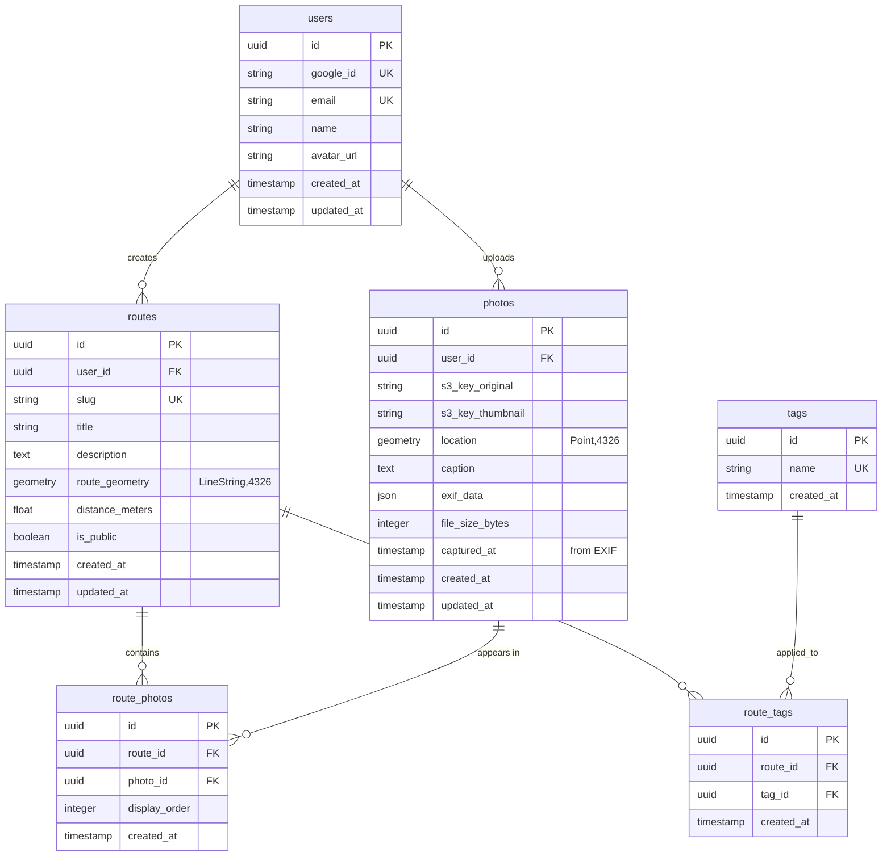
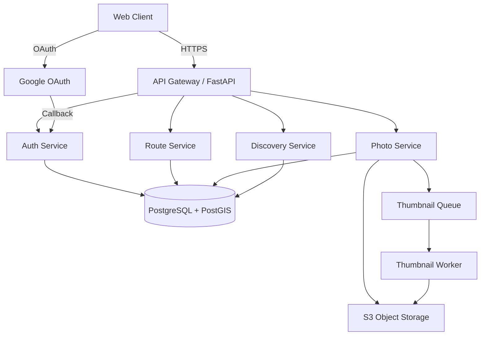
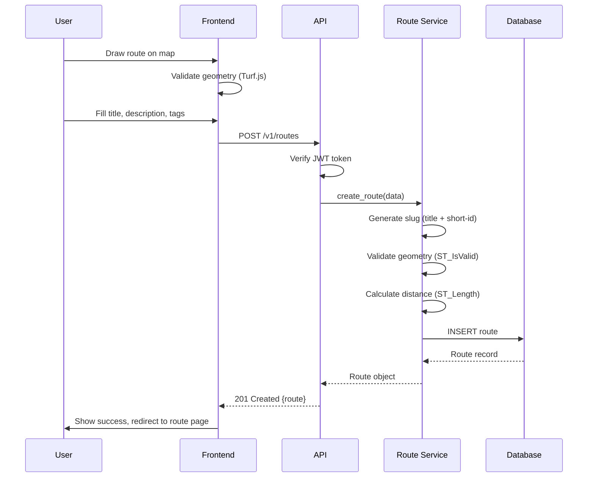
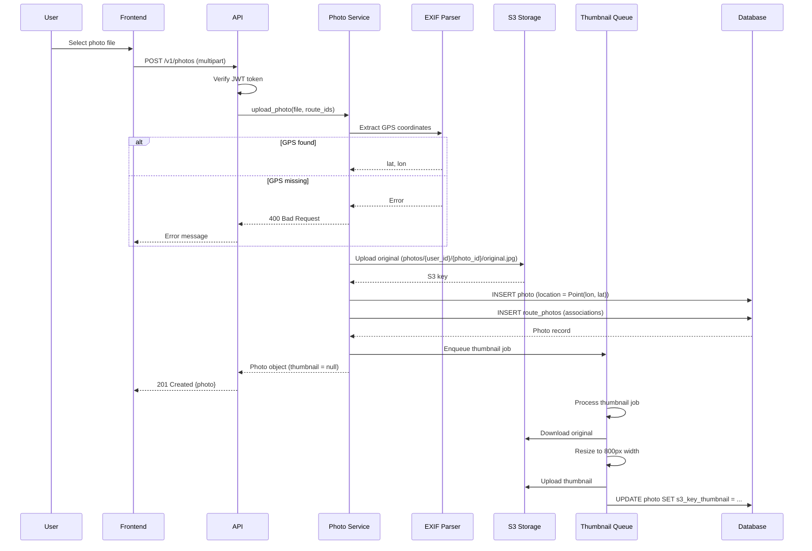
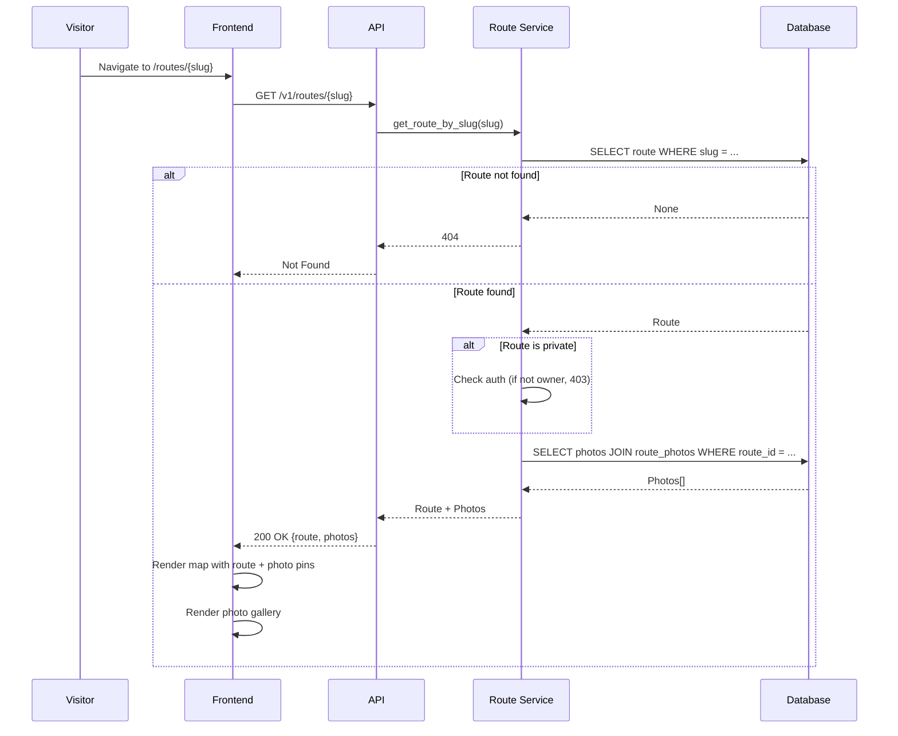
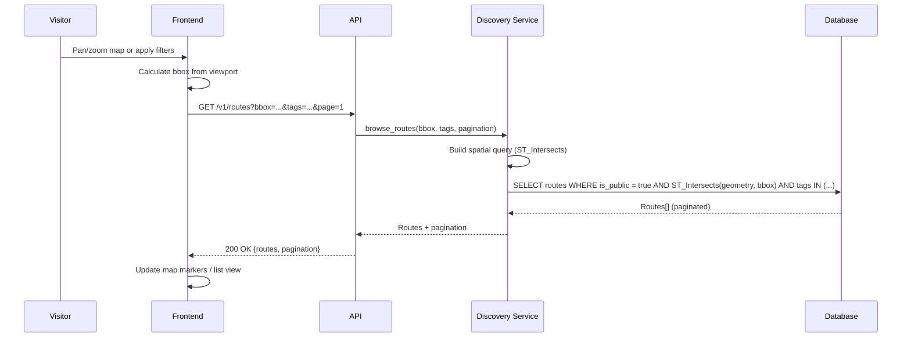

# Photowalker Product Requirements Document

**Version:** 1.0  
**Date:** 2026-02-05  
**Status:** Draft for Review

---

## Table of Contents

1. [Executive Summary](#executive-summary)
2. [Design Document Evaluation](#design-document-evaluation)
3. [Requirements](#requirements)
4. [Database Design](#database-design)
5. [Project Structure](#project-structure)
6. [API Specification](#api-specification)
7. [Data Flows](#data-flows)
8. [Out of Scope (MVP)](#out-of-scope-mvp)

---

## Executive Summary

Photowalker is a web application that enables photographers to create, share, and discover photowalk routes with geolocated photos. Each photowalk combines a curated route (LineString geometry) with photos (Point geometries) and narrative, creating a "living object" that captures how a place looked when walked.

**MVP Goal:** Enable photographers to create, publish, and share a photowalk route with geolocated photos, viewable on an interactive map.

**Core Value Proposition:** Instagram is no longer engaging for photographers. The real community in photography is found in photowalks and sharing stories through pictures.

---

## Design Document Evaluation

### Strengths (Alignment with Best Practices)

| Principle | Design Decision | Assessment |
|-----------|----------------|------------|
| **Single Responsibility** | Services split (Auth, Route, Photo, Discovery) | Clear separation of concerns; Discovery as separate service enables independent scaling |
| **Minimal Viable Product** | Explicit MVP scope, bounded user stories | Reduces scope creep; enables faster delivery and validation |
| **Technology Fit** | PostGIS for spatial, FastAPI, S3 for blobs | Appropriate: PostGIS excels at geo-queries, FastAPI supports async, S3 scales for images |
| **REST + JSON** | Standard API contract | Interoperable, easy to evolve, well-understood by developers |
| **OAuth over Custom Auth** | Google OAuth only for MVP | Reduces auth surface area and compliance risk; faster to implement |

### Gaps Identified and Resolved

1. **Database Design** → **Resolved:** Full schema with relationships, indexes, and migration strategy defined below
2. **Project Structure** → **Resolved:** Layered architecture with clear module boundaries specified
3. **Photo–Route Relationship** → **Resolved:** Many-to-many relationship via junction table to support photo reuse
4. **EXIF Fallback** → **Resolved:** GPS required for MVP; manual pin placement out of scope
5. **Slug Generation** → **Resolved:** Auto-generated with optional user override; collision handling defined
6. **Auth Strategy** → **Resolved:** JWT with refresh tokens in HTTP-only cookies
7. **Image Processing** → **Resolved:** Async thumbnail generation pipeline specified
8. **Rate Limiting** → **Resolved:** Basic quotas and limits defined in non-functional requirements
9. **API Versioning** → **Resolved:** `/v1/` prefix from day one
10. **Testing Strategy** → **Resolved:** Unit, integration, and E2E testing approach defined

---

## Requirements

### Functional Requirements

#### FR1: Authentication

**User Story:** As a user, I can sign in with Google OAuth.

**Acceptance Criteria:**
- User clicks "Sign in with Google" → redirected to Google OAuth consent screen
- After consent → user account created/retrieved → JWT tokens issued
- User session persists across browser sessions via refresh token
- User can sign out (invalidates refresh token)

**Edge Cases:**
- Google account already exists → login, don't create duplicate
- OAuth callback fails → show error message, allow retry
- Token refresh fails → redirect to login

#### FR2: Route Creation

**User Story:** As a user, I can create a photowalk route by drawing on a map.

**Acceptance Criteria:**
- User draws polyline on map using Mapbox GL Draw
- User provides: title (required), description (optional), tags (optional, max 5)
- System validates: polyline has ≥2 points, distance >0, title length 1-100 chars
- System generates slug: `{title-slug}-{short-id}` (e.g., `brooklyn-bridge-walk-a3f2`)
- User can optionally override slug (must be unique, alphanumeric + hyphens)
- Route saved with LineString geometry (WGS84/EPSG:4326)
- System calculates distance (meters) and stores it
- Route is private by default (user can make public later)

**Edge Cases:**
- Duplicate slug → append random suffix
- Invalid geometry (self-intersecting, too short) → validation error
- Title contains special chars → sanitized in slug generation

#### FR3: Photo Upload and Association

**User Story:** As a user, I can upload photos and attach them to routes.

**Acceptance Criteria:**
- User uploads JPEG files (max 10MB per file, max 50 per route)
- System extracts GPS coordinates from EXIF data
- If EXIF GPS missing → upload rejected with clear error
- Photo stored in S3: `photos/{user_id}/{photo_id}/original.jpg`
- Thumbnail generated asynchronously: `photos/{user_id}/{photo_id}/thumbnail.jpg` (max 800px width)
- Photo record created with Point geometry (WGS84)
- User can add caption (max 500 chars) and associate photo with one or more routes
- Photo appears as pin on map for associated routes

**Edge Cases:**
- Multiple photos at same location → all pins visible (clustering on frontend)
- Photo upload fails mid-transfer → partial upload cleaned up
- EXIF parsing fails → fallback to manual GPS entry (future enhancement, out of scope for MVP)

#### FR4: Route Viewing (Public)

**User Story:** As a visitor, I can view a shared route via public URL.

**Acceptance Criteria:**
- Route accessible at `/routes/{slug}` (no auth required for public routes)
- Page displays: map with route polyline, photo pins, photo gallery
- Click photo pin → photo opens in gallery/modal
- Map is interactive (zoom, pan, fullscreen)
- Route metadata visible: title, description, author name, creation date, distance, tags

**Edge Cases:**
- Invalid slug → 404
- Private route → 403 (unless user is owner)
- Route with no photos → map shows route only, empty gallery message

#### FR5: Route Browsing

**User Story:** As a visitor, I can browse public routes.

**Acceptance Criteria:**
- Browse page supports: list view and map view
- Map view: shows route markers within viewport (bbox query)
- List view: paginated (20 per page), sortable by date/popularity
- Filter by: location (bbox), tags (AND logic), author
- Click route → navigate to route detail page

**Edge Cases:**
- No routes in viewport → show "No routes found" message
- Bbox too large → limit to max 50km² area

### Non-Functional Requirements

#### NFR1: Performance

- Map load time: <2s for route with 50 photos
- Photo thumbnail load: <500ms per image
- API response time: p95 <200ms for route queries
- Image upload: accept up to 10MB files, process within 30s

#### NFR2: Availability

- API uptime: 99.5% (allows ~3.5 hours downtime/month)
- S3 storage: 99.9% availability (AWS SLA)

#### NFR3: Storage Limits

- Per user: 100 routes max (soft limit, can increase)
- Per route: 50 photos max
- Per photo: 10MB max file size
- Total storage per user: 5GB (soft limit)

#### NFR4: Rate Limiting

- API: 100 requests/minute per IP (authenticated: 500/min)
- Photo upload: 10 uploads/minute per user
- Route creation: 5 routes/hour per user

#### NFR5: Security

- JWT access tokens: 15min expiry
- JWT refresh tokens: 7 days expiry, HTTP-only cookie
- All API endpoints require HTTPS
- User can only edit/delete own routes and photos
- CORS configured for frontend domain only

#### NFR6: Testing

- Unit test coverage: ≥80% for business logic
- Integration tests: all API endpoints
- E2E tests: critical flows (create route, upload photo, view route)
- Tests run in CI on every PR

---

## Database Design

### Entity Relationship Diagram



### Schema Details

#### Table: `users`

| Column | Type | Constraints | Description |
|--------|------|-------------|-------------|
| `id` | UUID | PK, DEFAULT gen_random_uuid() | Primary key |
| `google_id` | VARCHAR(255) | UNIQUE, NOT NULL | Google OAuth subject ID |
| `email` | VARCHAR(255) | UNIQUE, NOT NULL | User email from Google |
| `name` | VARCHAR(255) | NOT NULL | Display name |
| `avatar_url` | TEXT | NULL | Google profile picture URL |
| `created_at` | TIMESTAMP | NOT NULL, DEFAULT now() | Account creation time |
| `updated_at` | TIMESTAMP | NOT NULL, DEFAULT now() | Last update time |

**Indexes:**
- `idx_users_google_id` on `google_id` (unique)
- `idx_users_email` on `email` (unique)

#### Table: `routes`

| Column | Type | Constraints | Description |
|--------|------|-------------|-------------|
| `id` | UUID | PK, DEFAULT gen_random_uuid() | Primary key |
| `user_id` | UUID | FK → users.id, NOT NULL | Route creator |
| `slug` | VARCHAR(255) | UNIQUE, NOT NULL | URL-friendly identifier |
| `title` | VARCHAR(100) | NOT NULL | Route title |
| `description` | TEXT | NULL | Route description |
| `route_geometry` | GEOMETRY(LineString, 4326) | NOT NULL | PostGIS LineString |
| `distance_meters` | FLOAT | NOT NULL | Calculated route distance |
| `is_public` | BOOLEAN | NOT NULL, DEFAULT false | Visibility flag |
| `created_at` | TIMESTAMP | NOT NULL, DEFAULT now() | Creation time |
| `updated_at` | TIMESTAMP | NOT NULL, DEFAULT now() | Last update time |

**Indexes:**
- `idx_routes_slug` on `slug` (unique, B-tree)
- `idx_routes_user_id` on `user_id` (B-tree)
- `idx_routes_geometry` on `route_geometry` (GIST, spatial)
- `idx_routes_public_created` on `is_public, created_at` (partial, WHERE is_public = true)
- `idx_routes_created_at` on `created_at` (B-tree, DESC)

**Spatial Index:** GIST index on `route_geometry` enables efficient bbox queries.

#### Table: `photos`

| Column | Type | Constraints | Description |
|--------|------|-------------|-------------|
| `id` | UUID | PK, DEFAULT gen_random_uuid() | Primary key |
| `user_id` | UUID | FK → users.id, NOT NULL | Photo uploader |
| `s3_key_original` | VARCHAR(500) | NOT NULL | S3 key for original image |
| `s3_key_thumbnail` | VARCHAR(500) | NULL | S3 key for thumbnail (nullable until processed) |
| `location` | GEOMETRY(Point, 4326) | NOT NULL | PostGIS Point from EXIF GPS |
| `caption` | TEXT | NULL | User-provided caption (max 500 chars) |
| `exif_data` | JSONB | NULL | Full EXIF metadata (for future use) |
| `file_size_bytes` | INTEGER | NOT NULL | Original file size |
| `captured_at` | TIMESTAMP | NULL | Photo capture time from EXIF |
| `created_at` | TIMESTAMP | NOT NULL, DEFAULT now() | Upload time |
| `updated_at` | TIMESTAMP | NOT NULL, DEFAULT now() | Last update time |

**Indexes:**
- `idx_photos_user_id` on `user_id` (B-tree)
- `idx_photos_location` on `location` (GIST, spatial)
- `idx_photos_created_at` on `created_at` (B-tree, DESC)

**Spatial Index:** GIST index on `location` enables efficient proximity queries.

#### Table: `route_photos` (Junction Table)

| Column | Type | Constraints | Description |
|--------|------|-------------|-------------|
| `id` | UUID | PK, DEFAULT gen_random_uuid() | Primary key |
| `route_id` | UUID | FK → routes.id, NOT NULL | Associated route |
| `photo_id` | UUID | FK → photos.id, NOT NULL | Associated photo |
| `display_order` | INTEGER | NOT NULL, DEFAULT 0 | Order in route gallery |
| `created_at` | TIMESTAMP | NOT NULL, DEFAULT now() | Association time |

**Indexes:**
- `idx_route_photos_route_id` on `route_id` (B-tree)
- `idx_route_photos_photo_id` on `photo_id` (B-tree)
- `idx_route_photos_route_order` on `route_id, display_order` (composite, for gallery ordering)
- `UNIQUE(route_id, photo_id)` (prevent duplicate associations)

**Note:** This many-to-many relationship enables photos to appear in multiple routes, supporting future features like route generation from existing photos.

#### Table: `tags`

| Column | Type | Constraints | Description |
|--------|------|-------------|-------------|
| `id` | UUID | PK, DEFAULT gen_random_uuid() | Primary key |
| `name` | VARCHAR(50) | UNIQUE, NOT NULL | Tag name (lowercase, normalized) |
| `created_at` | TIMESTAMP | NOT NULL, DEFAULT now() | Creation time |

**Indexes:**
- `idx_tags_name` on `name` (unique, B-tree, lowercase)

#### Table: `route_tags` (Junction Table)

| Column | Type | Constraints | Description |
|--------|------|-------------|-------------|
| `id` | UUID | PK, DEFAULT gen_random_uuid() | Primary key |
| `route_id` | UUID | FK → routes.id, NOT NULL | Tagged route |
| `tag_id` | UUID | FK → tags.id, NOT NULL | Applied tag |
| `created_at` | TIMESTAMP | NOT NULL, DEFAULT now() | Tagging time |

**Indexes:**
- `idx_route_tags_route_id` on `route_id` (B-tree)
- `idx_route_tags_tag_id` on `tag_id` (B-tree)
- `UNIQUE(route_id, tag_id)` (prevent duplicate tags)

### Migration Strategy

- **Tool:** Alembic (Python migration framework)
- **Approach:** Version-controlled migrations, idempotent where possible
- **Initial Migration:** Create all tables, indexes, PostGIS extension
- **Future Migrations:** Add columns, indexes, constraints incrementally

### Spatial Data Considerations

- **SRID:** 4326 (WGS84) for all geometries
- **Validation:** PostGIS `ST_IsValid()` on insert/update
- **Distance Calculations:** Use `ST_Distance()` or `ST_Length()` with geography casting for accurate meters
- **Bbox Queries:** Use `ST_Intersects(geometry, ST_MakeEnvelope(...))` for efficient spatial filtering

---

## Project Structure

### Backend Structure

```
backend/
├── app/
│   ├── __init__.py
│   ├── main.py                 # FastAPI app entry point
│   ├── config.py               # Settings (env vars, Pydantic)
│   │
│   ├── api/
│   │   └── v1/
│   │       ├── __init__.py
│   │       ├── auth.py         # POST /v1/auth/google, /refresh, GET /me
│   │       ├── routes.py       # Route CRUD endpoints
│   │       ├── photos.py       # Photo upload, list endpoints
│   │       └── discovery.py    # Browse, search endpoints
│   │
│   ├── services/
│   │   ├── __init__.py
│   │   ├── auth_service.py    # OAuth, JWT logic
│   │   ├── route_service.py   # Route business logic
│   │   ├── photo_service.py   # Photo upload, EXIF extraction
│   │   └── discovery_service.py # Spatial queries, filtering
│   │
│   ├── models/
│   │   ├── __init__.py
│   │   ├── user.py            # SQLAlchemy User model
│   │   ├── route.py           # SQLAlchemy Route model
│   │   ├── photo.py           # SQLAlchemy Photo model
│   │   └── tag.py             # SQLAlchemy Tag models
│   │
│   ├── db/
│   │   ├── __init__.py
│   │   ├── session.py         # Database session factory
│   │   └── base.py            # Base model class
│   │
│   ├── auth/
│   │   ├── __init__.py
│   │   ├── dependencies.py    # FastAPI dependencies (get_current_user)
│   │   ├── jwt.py             # JWT encode/decode
│   │   └── oauth.py           # Google OAuth client
│   │
│   ├── storage/
│   │   ├── __init__.py
│   │   └── s3.py              # S3 client wrapper
│   │
│   └── utils/
│       ├── __init__.py
│       ├── geometry.py         # PostGIS helpers, distance calc
│       ├── slug.py            # Slug generation
│       └── exif.py            # EXIF GPS extraction
│
├── alembic/
│   ├── versions/              # Migration files
│   └── env.py                # Alembic config
│
├── tests/
│   ├── __init__.py
│   ├── conftest.py           # Pytest fixtures
│   ├── unit/
│   │   ├── test_auth_service.py
│   │   ├── test_route_service.py
│   │   └── test_photo_service.py
│   ├── integration/
│   │   ├── test_api_auth.py
│   │   ├── test_api_routes.py
│   │   └── test_api_photos.py
│   └── e2e/
│       └── test_route_creation_flow.py
│
├── alembic.ini                # Alembic configuration
├── requirements.txt           # Python dependencies
├── requirements-dev.txt       # Dev dependencies (pytest, etc.)
└── .env.example               # Environment variable template
```

### Frontend Structure

```
frontend/
├── public/
│   └── index.html
│
├── src/
│   ├── App.tsx
│   ├── main.tsx
│   │
│   ├── api/
│   │   ├── client.ts          # Axios instance, interceptors
│   │   ├── auth.ts            # Auth API calls
│   │   ├── routes.ts          # Route API calls
│   │   └── photos.ts          # Photo API calls
│   │
│   ├── components/
│   │   ├── common/
│   │   │   ├── Button.tsx
│   │   │   ├── Input.tsx
│   │   │   └── Loading.tsx
│   │   ├── map/
│   │   │   ├── MapView.tsx    # MapLibre GL map wrapper
│   │   │   ├── RouteDrawer.tsx # Mapbox GL Draw integration
│   │   │   └── PhotoMarker.tsx # Photo pin component
│   │   └── routes/
│   │       ├── RouteForm.tsx  # Create/edit route form
│   │       ├── RouteView.tsx  # Route detail page
│   │       └── RouteList.tsx  # Browse routes list
│   │
│   ├── pages/
│   │   ├── Home.tsx
│   │   ├── CreateRoute.tsx
│   │   ├── RouteDetail.tsx
│   │   └── Browse.tsx
│   │
│   ├── hooks/
│   │   ├── useAuth.ts         # Auth state management
│   │   ├── useRoutes.ts       # Route data fetching
│   │   └── useMap.ts          # Map interaction logic
│   │
│   ├── store/
│   │   └── authStore.ts       # Auth state (Zustand/Context)
│   │
│   ├── types/
│   │   ├── route.ts           # Route TypeScript types
│   │   ├── photo.ts           # Photo TypeScript types
│   │   └── api.ts             # API response types
│   │
│   └── utils/
│       ├── geometry.ts        # Turf.js helpers
│       └── validation.ts     # Form validation
│
├── package.json
├── tsconfig.json
├── vite.config.ts            # Vite config (or similar)
└── .env.example
```

### Shared/Contracts

```
shared/
├── openapi.yaml              # OpenAPI 3.0 spec (source of truth)
└── types/                    # Optional: shared TypeScript types (if monorepo)
```

### Root Level

```
photowalker-app/
├── backend/                 # See above
├── frontend/                # See above
├── shared/                  # See above
├── docker-compose.yml       # Local dev: Postgres, Redis (if needed)
├── .gitignore
├── README.md                # Project overview, links to PRD
└── PRD.md                   # This document
```

---

## API Specification

### Base URL

- **Development:** `http://localhost:8000`
- **Production:** `https://api.photowalker.app`

All endpoints prefixed with `/v1/`.

### Authentication

**Flow:**
1. Frontend redirects to Google OAuth
2. Google redirects back with code
3. Frontend calls `POST /v1/auth/google` with code
4. Backend exchanges code for user info, creates/retrieves user, issues JWT
5. Access token in `Authorization: Bearer {token}` header
6. Refresh token in HTTP-only cookie

### Endpoints

#### Authentication

**POST `/v1/auth/google`**
- **Body:** `{ "code": string }`
- **Response:** `{ "access_token": string, "user": User }`
- **Sets cookie:** `refresh_token` (HTTP-only, 7 days)

**POST `/v1/auth/refresh`**
- **Headers:** Cookie with `refresh_token`
- **Response:** `{ "access_token": string }`

**POST `/v1/auth/logout`**
- **Headers:** Cookie with `refresh_token`
- **Response:** `{ "message": "Logged out" }`
- **Clears cookie:** `refresh_token`

**GET `/v1/auth/me`**
- **Headers:** `Authorization: Bearer {access_token}`
- **Response:** `{ "user": User }`

#### Routes

**POST `/v1/routes`**
- **Headers:** `Authorization: Bearer {access_token}`
- **Body:**
  ```json
  {
    "title": string,
    "description": string | null,
    "route_geometry": {
      "type": "LineString",
      "coordinates": [[lon, lat], ...]
    },
    "slug": string | null,  // Optional override
    "tags": string[],        // Max 5
    "is_public": boolean
  }
  ```
- **Response:** `{ "route": Route }`

**GET `/v1/routes/{slug}`**
- **Auth:** Optional (if private, requires owner)
- **Response:** `{ "route": Route, "photos": Photo[] }`

**PATCH `/v1/routes/{id}`**
- **Headers:** `Authorization: Bearer {access_token}`
- **Body:** Partial route fields
- **Response:** `{ "route": Route }`
- **Authorization:** Only route owner

**DELETE `/v1/routes/{id}`**
- **Headers:** `Authorization: Bearer {access_token}`
- **Response:** `{ "message": "Deleted" }`
- **Authorization:** Only route owner

**GET `/v1/routes`** (Browse)
- **Query params:**
  - `bbox`: `min_lon,min_lat,max_lon,max_lat` (optional)
  - `tags`: comma-separated tag names (optional)
  - `author_id`: UUID (optional)
  - `page`: integer (default 1)
  - `per_page`: integer (default 20, max 50)
  - `sort`: `created_at` | `distance` (default `created_at`)
- **Response:** `{ "routes": Route[], "pagination": { "page": int, "per_page": int, "total": int } }`

#### Photos

**POST `/v1/photos`**
- **Headers:** `Authorization: Bearer {access_token}`, `Content-Type: multipart/form-data`
- **Body:** FormData with:
  - `file`: File (JPEG, max 10MB)
  - `caption`: string (optional)
  - `route_ids`: string[] (UUIDs of routes to associate)
- **Response:** `{ "photo": Photo }`
- **Note:** Thumbnail generated asynchronously; `s3_key_thumbnail` may be null initially

**GET `/v1/routes/{route_id}/photos`**
- **Auth:** Optional (if route private, requires owner)
- **Query params:**
  - `order`: `display_order` | `captured_at` (default `display_order`)
- **Response:** `{ "photos": Photo[] }`

**PATCH `/v1/photos/{id}`**
- **Headers:** `Authorization: Bearer {access_token}`
- **Body:** `{ "caption": string | null, "route_ids": string[] }`
- **Response:** `{ "photo": Photo }`
- **Authorization:** Only photo owner

**DELETE `/v1/photos/{id}`**
- **Headers:** `Authorization: Bearer {access_token}`
- **Response:** `{ "message": "Deleted" }`
- **Authorization:** Only photo owner
- **Side effect:** Deletes from S3, removes from all route associations

### Data Types

**User:**
```typescript
{
  id: string;           // UUID
  email: string;
  name: string;
  avatar_url: string | null;
  created_at: string;   // ISO 8601
}
```

**Route:**
```typescript
{
  id: string;           // UUID
  user_id: string;     // UUID
  slug: string;
  title: string;
  description: string | null;
  route_geometry: {
    type: "LineString";
    coordinates: [number, number][];  // [lon, lat]
  };
  distance_meters: number;
  is_public: boolean;
  tags: string[];      // Tag names
  created_at: string;
  updated_at: string;
}
```

**Photo:**
```typescript
{
  id: string;           // UUID
  user_id: string;      // UUID
  s3_key_original: string;
  s3_key_thumbnail: string | null;
  location: {
    type: "Point";
    coordinates: [number, number];  // [lon, lat]
  };
  caption: string | null;
  file_size_bytes: number;
  captured_at: string | null;  // ISO 8601
  created_at: string;
  updated_at: string;
}
```

### Error Responses

All errors follow this format:
```json
{
  "error": {
    "code": string,      // e.g., "VALIDATION_ERROR"
    "message": string,
    "details": object | null
  }
}
```

**HTTP Status Codes:**
- `200` OK
- `201` Created
- `400` Bad Request (validation errors)
- `401` Unauthorized (missing/invalid token)
- `403` Forbidden (not owner)
- `404` Not Found
- `429` Too Many Requests (rate limit)
- `500` Internal Server Error

---

## Data Flows

### System Architecture



### Create Route Flow



### Upload Photo Flow



### View Route Flow



### Browse Routes Flow



---

## Out of Scope (MVP)

The following features are explicitly **not** included in MVP but may be considered for future versions:

### User Features
- User profiles beyond name + avatar
- Following other users
- Comments on routes/photos
- Likes/favorites
- Collections/bookmarks
- User statistics (routes created, photos uploaded)

### Route Features
- Multiple authors per route (collaborative editing)
- Route versioning/history
- Route templates
- Route sharing via social media (beyond public URL)
- Route export (GPX, KML)
- Route import from GPX/KML

### Photo Features
- Manual GPS pin placement (photos without EXIF GPS)
- Photo editing/filters
- Photo albums separate from routes
- Photo search by location
- Photo metadata editing (EXIF modification)
- Multiple formats (RAW, PNG, etc.) - JPEG only for MVP

### Discovery Features
- Advanced search (full-text on descriptions)
- Route recommendations based on user activity
- Trending/popular routes algorithm
- Route difficulty ratings
- Weather integration
- Time-of-day filters (sunrise/sunset routes)

### Technical Features
- Mobile native apps (iOS/Android)
- Offline mode / PWA capabilities
- Real-time collaboration
- WebSocket updates
- CDN integration (beyond S3)
- Image optimization beyond thumbnails (WebP, AVIF)
- Video support
- Batch photo upload
- Route auto-generation from photos (future enhancement)

### Infrastructure
- Multi-region deployment
- Advanced monitoring/alerting (beyond basic logging)
- A/B testing framework
- Analytics dashboard

---

## Appendix: Technology Stack Summary

### Backend
- **Framework:** FastAPI (Python 3.11+)
- **Database:** PostgreSQL 15+ with PostGIS 3.3+
- **ORM:** SQLAlchemy 2.0+
- **Migrations:** Alembic
- **Auth:** Google OAuth 2.0, PyJWT
- **Storage:** AWS S3 (or compatible)
- **Image Processing:** Pillow (PIL) for thumbnails
- **EXIF:** exifread or Pillow EXIF
- **Async Jobs:** Celery + Redis (or RQ) for thumbnail generation

### Frontend
- **Framework:** React 18+ with TypeScript
- **Build Tool:** Vite
- **Maps:** MapLibre GL JS (open-source Mapbox GL fork)
- **Route Drawing:** Mapbox GL Draw
- **Geo Utils:** Turf.js
- **HTTP Client:** Axios
- **State Management:** Zustand or React Context
- **Routing:** React Router

### Infrastructure
- **Containerization:** Docker (optional, for local dev)
- **CI/CD:** GitHub Actions (or similar)
- **Hosting:** TBD (Render, Railway, AWS, etc.)

---

**Document Status:** Ready for Review  
**Next Steps:** Review PRD → Approve → Begin implementation
