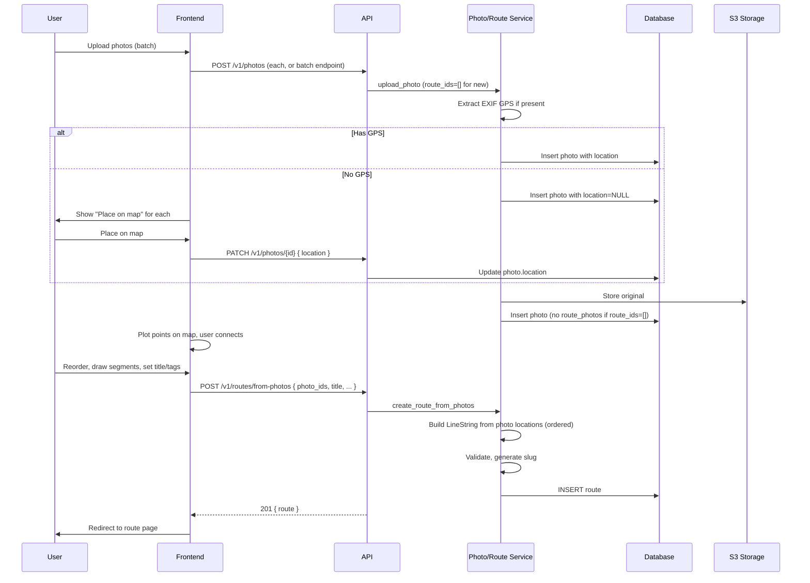
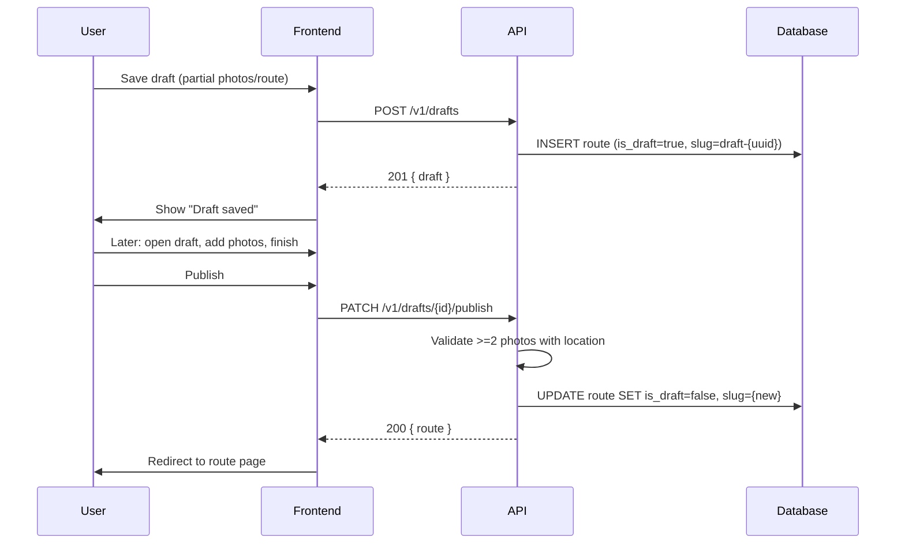

# Photowalker Product Requirements Document

**Version:** 3.0  
**Date:** 2026-02-06  
**Status:** Specification  
**Previous Version:** [PRD v2.0](./PRD_v2.md)

---

## Table of Contents

1. [Executive Summary](#executive-summary)
2. [Version 3 Changes](#version-3-changes)
3. [Requirements](#requirements)
4. [Database Changes](#database-changes)
5. [API Changes](#api-changes)
6. [Data Flows](#data-flows)
7. [Implementation Phases](#implementation-phases)
8. [Out of Scope (v3)](#out-of-scope-v3)

---

## Executive Summary

Photowalker is a web application that enables photographers to create, share, and discover photowalk routes with geolocated photos. Each photowalk combines a curated route (LineString geometry) with photos (Point geometries) and narrative, creating a "living object" that captures how a place looked when walked.

**v3 Goal:** Improve the user experience for creating and interacting with routes and photos. Photo-first route creation becomes the primary flow: users upload photos, then connect them on the map to create a route. Routes are strictly derived from photo locations.

**Core Value Proposition:** Instagram is no longer engaging for photographers. The real community in photography is found in photowalks and sharing stories through pictures.

**Version 3 Focus:** UX enhancements for route and photo workflows—photo-first creation, strict route-photo consistency, photos without GPS, location editing, thumbnail map pins, bulk reorder, add/remove photos, GPX export, clustering, undo/redo, and route drafts.

---

## Version 3 Changes

### Summary of Changes vs v2

| Area | v2 Behavior | v3 Behavior |
|------|-------------|-------------|
| **Route creation** | Draw polyline first, add photos later | Photo-first: upload photos, connect on map, route derived from photo locations |
| **Route-photo consistency** | Independent; photos can be off-route | Strict: route geometry always derived from photo locations |
| **Photo upload** | EXIF GPS required; reject if missing | EXIF GPS optional; allow manual placement for photos without GPS |
| **Photo location** | Read-only from EXIF | Editable via PATCH; map picker in UI |
| **Map pins** | Blue dots (24px) | Thumbnail images (~40–48px); clustering at low zoom |
| **Photo ordering** | display_order on add | Bulk reorder via drag-and-drop |
| **Route photos** | Add-only | Add and remove; route geometry updates on change |
| **Export** | None | GPX with photo waypoints (Google Maps compatible) |
| **Route drawing** | Mapbox GL Draw | Mapbox GL Draw + undo/redo |
| **Drafts** | None | Save work-in-progress as draft route |

### Inherited from v2

- Authentication (FR1), Route Viewing (FR4), Route Browsing (FR5)
- Non-functional requirements (NFR1–NFR6)
- Database design (with schema changes noted in Database Changes)
- Project structure, infrastructure, monitoring
- API patterns and error handling

---

## Requirements

### Inherited Functional Requirements (unchanged)

#### FR1: Authentication

**User Story:** As a user, I can sign in with Google OAuth.

**Acceptance Criteria:** Per [PRD v2 - FR1](./PRD_v2.md#fr1-authentication).

#### FR4: Route Viewing (Public)

**User Story:** As a visitor, I can view a shared route via public URL.

**Acceptance Criteria:** Per [PRD v2 - FR4](./PRD_v2.md#fr4-route-viewing-public). Enhanced: photo pins show thumbnails; clustering at low zoom.

#### FR5: Route Browsing

**User Story:** As a visitor, I can browse public routes.

**Acceptance Criteria:** Per [PRD v2 - FR5](./PRD_v2.md#fr5-route-browsing).

---

### New / Revised Functional Requirements

#### FR-R1: Photo-First Route Creation

**User Story:** As a user, I can create a route by uploading photos and connecting them on a map.

**Acceptance Criteria:**
- Primary entry point: "Create route from photos"
- User uploads one or more JPEG files (max 10MB each, max 50 total)
- Photos with EXIF GPS: plotted as points on map automatically
- Photos without EXIF GPS: user must place each on map before proceeding
- Points ordered by `captured_at` (or upload order if missing)
- User connects points to form route: draw segments between them, reorder (drag-and-drop), add or remove points
- Route geometry (LineString) derived from photo locations in `display_order`
- User provides: title (required), description (optional), tags (optional, max 5)
- System validates: route has ≥2 photo points, distance >0, title 1–100 chars
- Route saved with LineString through photo locations; distance calculated and stored

**Edge Cases:**
- Single photo upload → prompt to add more or place and save as draft
- All photos without GPS → show "Place on map" step for each before connecting
- Duplicate slug → append random suffix
- Invalid geometry → validation error with clear message

---

#### FR-R2: Strict Route-Photo Consistency

**User Story:** As a user, I expect routes to always reflect the photos they contain.

**Acceptance Criteria:**
- Route geometry is always derived from photo locations
- Vertices of route LineString = (or interpolated between) photo points in `display_order`
- No "orphan" photos: photos in a route define the route
- When photos are added/removed/reordered, route geometry is recomputed
- Business logic enforces: `route_geometry` computed from `route_photos` ordered by `display_order` (or `captured_at`)

**Edge Cases:**
- Route with 0 photos → not valid (draft or requires at least 2 photos to publish)
- Route with 1 photo → draft only; need ≥2 to form LineString

---

#### FR-R3: Photos Without Location + Location Editing

**User Story:** As a user, I can upload photos without GPS and place them on the map in-app. I can also edit the location of any photo.

**Acceptance Criteria:**
- Photo upload accepts JPEGs with or without EXIF GPS
- If no GPS: store with `location=NULL`; show "Place on map" step after upload
- User places photo by clicking/dragging on map; location saved before route creation completes
- PATCH `/v1/photos/{id}` accepts `location: { type: "Point", coordinates: [lon, lat] } | null`
- Route detail: photo context menu or edit modal with "Edit location" → map picker
- Coordinates validated: lon in [-180, 180], lat in [-90, 90]

**Edge Cases:**
- Photo without location in route → must be placed before route can be published
- Editing location of photo in route → route geometry recomputed

---

#### FR-R4: Thumbnail Pins on Map

**User Story:** As a user, I can see photo thumbnails as pins on the map instead of blue dots.

**Acceptance Criteria:**
- Map pins render photo thumbnails (~40–48px) when available
- Fallback to blue dot when thumbnail not yet generated or load fails
- Lazy-load thumbnails; show placeholder until loaded
- At low zoom, use clustering: nearby pins grouped with count badge; expand on zoom or click

**Edge Cases:**
- Thumbnail processing pending → blue dot until ready
- Many photos in small area → clustering prevents overlap

---

#### FR-R5: Bulk Reorder Photos

**User Story:** As a user, I can reorder photos in a route by drag-and-drop.

**Acceptance Criteria:**
- Photo gallery supports drag-and-drop to change order
- Order persisted as `display_order` in `route_photos`
- Route geometry recomputed when order changes (LineString vertices follow new order)
- UI reflects new order immediately; API PATCH updates `display_order` for affected route_photos

**Edge Cases:**
- Reorder affects only the route context; photo may exist in other routes with different order

---

#### FR-R6: Add/Remove Photos from Routes

**User Story:** As a user, I can add and remove photos from existing routes.

**Acceptance Criteria:**
- Add: upload new photo or associate existing photo with route (if user owns both)
- Remove: unlink photo from route; route geometry recomputed from remaining photos
- Route must have ≥2 photos to remain valid; if 1 photo after remove, treat as draft or block remove with message
- Remove does not delete the photo; only removes route association

**Edge Cases:**
- Remove last photo → route becomes invalid; either block or convert to draft
- Add photo without location → must place on map before route geometry can include it

---

#### FR-R7: Export GPX with Photo Waypoints

**User Story:** As a user, I can export a route as a GPX file with photo locations as waypoints.

**Acceptance Criteria:**
- Export button on route detail page (owner or public route)
- GET or POST endpoint returns GPX file (Content-Type: application/gpx+xml)
- GPX contains route as track and photo locations as waypoints (name = caption or photo index)
- File compatible with Google Maps (import/export), other GPS apps
- Filename: `{route-slug}.gpx`

**Edge Cases:**
- Route with no photos → export route track only
- Photos without location → exclude from waypoints or use route point if interpolated

---

#### FR-R8: Photo Clustering on Map

**User Story:** As a user, I see grouped pins when many photos are close together at low zoom.

**Acceptance Criteria:**
- At low zoom: cluster nearby photo pins with count badge
- On zoom in or click cluster: expand to show individual pins (or thumbnails)
- Clustering algorithm: distance/zoom-based (e.g. MapLibre/supercluster or similar)
- Cluster icon shows count; styling consistent with app theme

**Edge Cases:**
- Single photo → no cluster
- Many photos at same location → cluster with count

---

#### FR-R9: Undo/Redo for Route Drawing

**User Story:** As a user, I can undo and redo drawing actions when connecting photos on the map.

**Acceptance Criteria:**
- Undo: revert last draw action (add point, remove point, move point)
- Redo: reapply last undone action
- Keyboard shortcuts: Ctrl+Z / Cmd+Z (undo), Ctrl+Shift+Z / Cmd+Shift+Z (redo)
- Visual feedback: undo/redo buttons in route creation UI
- History limited to current session (e.g. last 20 actions)

**Edge Cases:**
- Undo on empty → no-op
- Redo when nothing to redo → no-op

---

#### FR-R10: Route Drafts

**User Story:** As a user, I can save work-in-progress as a draft and finish later.

**Acceptance Criteria:**
- "Save draft" stores: uploaded photos (with or without locations), partial route, title/description
- Draft not visible in browse; only owner can access
- Draft has temp identifier (e.g. `/drafts/{id}` or slug `draft-{uuid}`)
- "Publish" converts draft to full route: validates ≥2 photos with locations, generates slug, sets is_public
- Drafts listed in "My routes" or "Drafts" section
- Draft can be discarded (deleted)

**Edge Cases:**
- Draft with 0 photos → valid (in progress)
- Draft with 1 photo → valid
- Publish draft with &lt;2 photos → validation error
- Publish draft with photos missing location → validation error, prompt to place

---

### Non-Functional Requirements

Per [PRD v2 - NFR1 through NFR6](./PRD_v2.md#non-functional-requirements). No changes.

---

## Database Changes

### Schema Changes from v2

#### Table: `photos`

| Column | Change |
|--------|--------|
| `location` | **Nullable.** Allow `NULL` for photos without GPS. Migration: `ALTER TABLE photos ALTER COLUMN location DROP NOT NULL`. GIST index on `location` remains; nulls excluded from spatial queries. |

#### Table: `routes`

| Column | Change |
|--------|--------|
| `is_draft` | **New.** `BOOLEAN NOT NULL DEFAULT false`. Draft routes: not in browse, owner-only access. When `is_draft=true`, slug may be `draft-{uuid}` or similar temp value. |
| `slug` | For drafts: allow `draft-{uuid}` pattern; must be unique. On publish: generate normal slug. |

**Index:**
- `idx_routes_is_draft_user` on `(is_draft, user_id)` for listing user's drafts (partial: `WHERE is_draft = true`).

### Migration Summary

1. **003_photos_location_nullable.py**: `photos.location` nullable.
2. **004_routes_drafts.py**: Add `is_draft` to `routes`; add index.

### Unchanged Tables

- `users`, `route_photos`, `route_tags`, `tags` — no schema changes.

---

## API Changes

### New Endpoints

#### Route Drafts

**POST `/v1/drafts`**
- **Headers:** `Authorization: Bearer {access_token}`
- **Body:** Same as route create, but `is_draft: true` implied. `route_geometry` may be empty or partial.
- **Response:** `{ "draft": Route }` (Route with `is_draft: true`)
- **Note:** Draft may have 0 or 1 photo; geometry optional.

**GET `/v1/drafts`**
- **Headers:** `Authorization: Bearer {access_token}`
- **Response:** `{ "drafts": Route[] }` — current user's drafts.

**PATCH `/v1/drafts/{id}/publish`**
- **Headers:** `Authorization: Bearer {access_token}`
- **Body:** `{ "title", "description", "tags", "is_public" }` — final metadata
- **Response:** `{ "route": Route }` — published route with slug, `is_draft: false`
- **Validation:** ≥2 photos with locations; valid LineString.

**DELETE `/v1/drafts/{id}`**
- **Headers:** `Authorization: Bearer {access_token}`
- **Response:** `{ "message": "Deleted" }`

#### Route from Photos

**POST `/v1/routes/from-photos`**
- **Headers:** `Authorization: Bearer {access_token}`
- **Body:**
  ```json
  {
    "title": string,
    "description": string | null,
    "tags": string[],
    "is_public": boolean,
    "photo_ids": string[],       // UUIDs, ordered; geometry derived from these
    "slug": string | null
  }
  ```
- **Response:** `{ "route": Route }`
- **Validation:** All photo_ids must have `location` set; ≥2 photos. Route geometry = LineString through photo locations in order.

#### GPX Export

**GET `/v1/routes/{slug}/gpx`**
- **Auth:** Optional (public routes); private requires owner.
- **Response:** `application/gpx+xml` — GPX file with route track and photo waypoints.
- **Headers:** `Content-Disposition: attachment; filename="{slug}.gpx"`

#### Photo Reorder

**PATCH `/v1/routes/{route_id}/photos/order`**
- **Headers:** `Authorization: Bearer {access_token}`
- **Body:** `{ "photo_ids": string[] }` — ordered list of photo UUIDs
- **Response:** `{ "photos": Photo[] }` — updated order
- **Side effect:** Recompute route geometry from new order.

#### Remove Photo from Route

**DELETE `/v1/routes/{route_id}/photos/{photo_id}`**
- **Headers:** `Authorization: Bearer {access_token}`
- **Response:** `{ "message": "Removed" }`
- **Side effect:** Remove route_photo; recompute route geometry. If &lt;2 photos remain, route becomes draft or validation error per product decision.

### Modified Endpoints

#### PATCH `/v1/photos/{id}`

**Body** (add):
```json
{
  "caption": string | null,
  "route_ids": string[],
  "location": { "type": "Point", "coordinates": [lon, lat] } | null
}
```

#### POST `/v1/photos`

**Behavior change:**
- Do not reject when EXIF GPS missing. Store with `location=NULL`. Return photo; client handles "Place on map" flow, then PATCH to set location.
- `route_ids=[]` is valid when starting new route creation (photos uploaded first, route created later via POST /v1/routes/from-photos).

#### POST `/v1/routes`

**Deprecated or secondary.** Prefer `POST /v1/routes/from-photos`. If retained for migration: same as v2, but validation may require route geometry to match photo locations for routes with photos.

### Data Types

**Photo** (updated):
```typescript
{
  id: string;
  user_id: string;
  s3_key_original: string;
  s3_key_thumbnail: string | null;
  location: { type: "Point"; coordinates: [number, number] } | null;  // Now nullable
  caption: string | null;
  file_size_bytes: number;
  captured_at: string | null;
  created_at: string;
  updated_at: string;
}
```

**Route** (add):
```typescript
{
  // ... existing fields
  is_draft: boolean;
}
```

---

## Data Flows

### Photo-First Route Creation Flow



### Route Draft Flow



---

## Implementation Phases

Suggested implementation order:

| Phase | Scope | Dependencies |
|-------|-------|--------------|
| **Phase 1: Foundation** | DB migration (photos.location nullable, routes.is_draft), PATCH photo location, upload without GPS | None |
| **Phase 2: Photo-first creation** | POST /routes/from-photos, new Create Route flow (upload → place → connect), route geometry from photos | Phase 1 |
| **Phase 3: Map UX** | Thumbnail pins, photo clustering, undo/redo for drawing | Phase 2 |
| **Phase 4: Route management** | Bulk reorder, add/remove photos, PATCH photos/order, DELETE route photo | Phase 2 |
| **Phase 5: Export & drafts** | GPX export, route drafts (POST/GET drafts, publish) | Phase 2 |

---

## Out of Scope (v3)

The following are explicitly not in v3 scope:

- Virtual walk / photobook viewer (deferred to future milestone)
- Route import from GPX/KML
- Draw-only route creation as primary flow (deprecated in favor of photo-first)
- Duplicate route ("Save a copy")
- PDF photobook export
- Route snap-to-roads

### Still Out of Scope (from v2)

- User profiles beyond name + avatar
- Comments, likes, collections
- Route versioning/history
- Manual GPS for v2 MVP (now in scope for v3)
- Route auto-generation from photos (v2 out of scope; v3 implements photo-first creation)

---

**Document Status:** Specification  
**Next Steps:** Review PRD v3, approve, create Implementation Roadmap v3, begin Phase 1.
