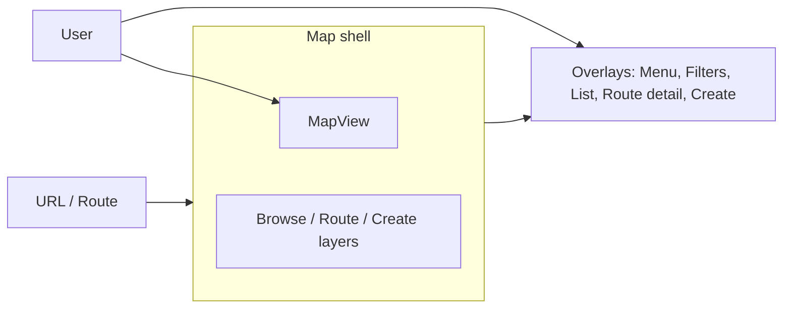

# Photowalker Product Requirements Document — Map-First Frontend Overhaul (v4)

**Version:** 4.0  
**Date:** 2026-02-15  
**Status:** Specification  
**Previous Version:** [PRD v3](./PRD_v3.md)  
**Scope:** Frontend UI/UX only; backend unchanged.

---

## Table of Contents

1. [Executive Summary](#executive-summary)
2. [Objectives and Success Criteria](#objectives-and-success-criteria)
3. [Current State](#current-state)
4. [Target Design](#target-design)
5. [Requirements](#requirements)
6. [Impact Surface](#impact-surface)
7. [Out of Scope](#out-of-scope)

---

## Executive Summary

This PRD defines a **map-first** frontend rework for Photowalker (v4). The map becomes the primary canvas: it fills the viewport at all times for map-using flows. All other UI—navigation, browse filters and list, route detail, create flow, auth—is presented as **minimal popups** (drawers, panels, or modals). The focus is on map navigation; overlays appear on demand and can be dismissed to return to the map.

**Design principle:** One full-viewport map; everything else is an overlay.

**Relationship to v3:** PRD v3 covers product features (photo-first creation, drafts, GPX, etc.). This v4 PRD is limited to frontend layout and map-first UX; it does not change backend or v3 feature set.

---

## Objectives and Success Criteria

1. **Map fills viewport** — One map container occupies 100vw × 100vh (minus any minimal chrome).
2. **All other UI is minimal popups** — Nav, filters, lists, route detail, photos, create flow, and login appear as overlays (drawers, modals, or compact floating panels), not full-page content.
3. **Focus on map navigation** — Primary interaction is pan/zoom/click on map; overlays open on demand and can be dismissed to return focus to the map.

---

## Current State

### Stack and Routing

- **Stack:** React 19, Vite 7, react-router-dom 6, maplibre-gl 4.7, zustand. Frontend only; backend unchanged.
- **Routing:** Top nav (Home, Browse, My routes, Create route, Sign in/out). Routes: `/`, `/browse`, `/login`, `/auth/callback`, `/routes/me`, `/routes/create`, `/routes/:slug`, `*`.

### Layout Constraints

- `body`: flex, `place-items: center`, `min-height: 100vh`.
- `#root`: `max-width: 1280px`, `margin: 0 auto`, `padding: 2rem`, `text-align: center` — prevents full-viewport map.

### Page-by-Page UI Today

| Page | Current layout |
|------|----------------|
| **Browse** | Column: top bar (Map/List toggle, Tags); then either MapPanel + MapView or RouteList. Map is in a panel, not full viewport. |
| **Route detail** | Padded container; breadcrumb; RouteView (MapPanel + MapView + metadata); Photos section. Edit-location and add-photos are modals. Map has fixed height (~320px). |
| **RouteView** | MapPanel + MapView, then title/description/dl. Map is one block in document flow. |
| **Home** | Centered content; no map. |
| **My routes** | List of links; no map. |
| **Create route** | Centered form (max-width 720px): upload, reorder list, 280px-tall map, route details form. "Place photo" and "Edit location" are modals. |

### Map Components

- **MapView** — MapLibre container.
- **MapPanel** — Wrapper with optional overlay (e.g. loading message).
- **MapPicker** — Click-to-select coordinates.

Map is used in: Browse (bbox fetch, route clusters), RouteView (polyline + photo pins/clusters), CreateRouteFromPhotos (preview line + markers).

### Patterns to Preserve

- Map + control teardown: single owner, try/catch cleanup (per frontend doctrine).
- Protected image URLs via api client.
- Blob URL cache at parent for reorderable lists.
- `usePreferredMapCenter` for initial center/zoom.

---

## Target Design

### Textual / ASCII UI Layout

```
+--------------------------------------------------------------------------------------------------+
|  [Menu]                                    (optional: small logo/title)                    [x]  |  <- Minimal top bar or FAB menu
+--------------------------------------------------------------------------------------------------+
|                                                                                                  |
|                                                                                                  |
|                              FULL-VIEWPORT MAP (MapLibre)                                        |
|                              - Browse: route pins/clusters                                       |
|                              - Route detail: polyline + photo pins                               |
|                              - Create: preview line + photo markers                              |
|                              - Home: empty map or subtle CTA layer                               |
|                                                                                                  |
|                                                                                                  |
|  +----------------------+  +----------------------+                                              |
|  | Popup / Drawer       |  | (e.g. route detail   |  <- Overlays when opened (e.g. slide from     |
|  | e.g. Browse filters  |  |  panel: title, meta, |     right or bottom sheet; modal for auth)   |
|  | + list or tags       |  |  photos, actions)    |                                              |
|  +----------------------+  +----------------------+                                              |
|                                                                                                  |
+--------------------------------------------------------------------------------------------------+
```

### Overlay Inventory (Target)

| Context | Current | Target overlay |
|---------|---------|----------------|
| App nav | Top bar full width | Hamburger or FAB → menu popup |
| Browse | Top bar + Map/List + Tags | Map full; "Filters" opens tags; "List" opens drawer/panel with RouteList |
| Route detail | Full page: map + metadata + photos | Map full; route strip or panel (title, meta, photos, add-photos) |
| My routes | Full page list | Map full; "My routes" opens list in drawer |
| Create route | Full page form | Map full; "Create" opens drawer/sheet with steps (upload, order, details) |
| Home | Centered CTA content | Map full with welcome/CTA popup or redirect to map |
| Login | Centered form | Modal (unchanged conceptually) |
| Edit location / Place photo | Modal with MapPicker | Keep as modal (already overlay) |

### Architecture: Single Map Shell, Route-Driven Overlays

- **Map shell:** One layout component that renders a single full-viewport map (one MapView instance) for all map-using routes.
- **Route-driven layers:** Current route (and params like `slug`) determine which map layers to show (browse clusters, route polyline + photos, create preview) and which overlay to show (none, browse filters/list, route detail panel, create drawer, menu).
- **URL as source of truth:** `/browse` = map + browse data + optional list overlay; `/routes/:slug` = map + that route's data + optional detail overlay; `/routes/create` = map + create overlay; `/routes/me` = map + "my routes" list overlay. Shareable links and browser back/forward preserved.

### High-Level Data Flow (Target)



---

## Requirements

### FR-M1: Full-Viewport Map Shell

**User Story:** As a user, I always see the map filling the screen when browsing, viewing a route, or creating a route.

**Acceptance Criteria:**

- One map container occupies 100vw × 100vh (minus minimal chrome such as a menu control).
- The same map instance is used across route changes (browse, route detail, create); layers and data switch without unmounting the map.
- No page layout (max-width, padding) constrains the map to a panel; root/layout CSS allows the map shell to be full viewport.

### FR-M2: Minimal Chrome and Overlays

**User Story:** As a user, I access navigation and secondary content via minimal popups so the map stays the focus.

**Acceptance Criteria:**

- Global navigation is available via a minimal entry point (e.g. hamburger or FAB) that opens a menu popup. No full-width top nav bar when the map is shown.
- Browse: filters (e.g. tags) and list (RouteList) are available via controls that open overlays (drawer or panel), not inline above or beside the map.
- Route detail: route metadata (title, description, distance, tags) and photo gallery are in a slide-out or bottom panel; map remains full viewport with route polyline and photo pins.
- My routes: list is shown in a drawer opened from the menu.
- Create route: upload, photo order, and route details form are in a drawer or bottom sheet; map shows preview line and markers.
- Home: either map fills viewport with a small welcome/CTA overlay, or app redirects to `/browse` (map).
- Login: remains a modal or full-screen overlay; no structural change to content.
- Edit location / Place photo: remain modals (already overlay).

### FR-M3: Map-First Interaction

**User Story:** As a user, my primary interaction is with the map; I open overlays only when I need them.

**Acceptance Criteria:**

- Primary interaction is pan/zoom/click on the map.
- Clicking a route pin (browse) or photo pin (route detail) can open the relevant overlay or navigate to route with overlay open.
- Overlays can be dismissed (e.g. close button, escape, click outside) to return focus to the map.
- URL remains source of truth so direct links and back/forward work (e.g. `/routes/:slug` shows map + route + optional detail panel).

### FR-M4: Preserved Functionality

**User Story:** As a user, all existing workflows (browse, view route, create route, my routes, auth) still work.

**Acceptance Criteria:**

- Browse: bbox-based route fetch, clustering, tags filter, and list view are available via map + overlays.
- Route detail: route polyline, photo pins, clustering, metadata, photo gallery, add-photos (owner), edit location (owner) work; data and behavior unchanged from backend perspective.
- Create route: upload, place on map, reorder, route details form, submit to POST /v1/routes/from-photos unchanged in capability; only layout moves into overlay over full-viewport map.
- My routes: list and navigation to route detail work from drawer.
- Auth: sign in / sign out and protected routes unchanged.

---

## Impact Surface

### Layout and Shell

- **App.tsx** — Replace top nav with minimal chrome (e.g. FAB or corner menu); wrap map-using routes in a full-viewport map shell.
- **index.css** — Remove or adjust `place-items: center` so map shell can fill viewport; allow `#root` to fill viewport when map is shown.
- **App.css** — Remove or scope `#root` max-width/padding for map shell; retain or relocate non-map styles.

### Pages (Become Overlay Content or Map Context)

- **Home** — Map full with welcome/CTA overlay, or redirect to `/browse`.
- **Browse** — Map fills viewport; Filters/List open overlays.
- **RouteDetail** — Map full viewport; metadata + PhotoGallery + add-photos in panel/drawer.
- **MyRoutes** — Map full; list in drawer from menu.
- **CreateRouteFromPhotos** — Map full viewport; upload/order/details in drawer or sheet.
- **Login** — Keep as overlay (modal).
- **NotFound** — Show on map (e.g. small toast/panel) or minimal full-screen message.

### Components

- **MapPanel** — Use only for overlay message (e.g. "Zoom in") where needed; map container is direct full-viewport div.
- **MapView** — No API change; used inside new full-viewport container.
- **RouteView** — Split: map part (polyline + pins) lives in/controlled by map shell when route slug is set; metadata (title, description, dl) move to route-detail overlay.
- **RouteList** — Reused inside browse drawer/panel.
- **PhotoGallery** — Reused inside route-detail overlay.
- **New:** Map shell component (full viewport wrapper, owns single MapView).
- **New:** Overlay/drawer/panel components for filters, list, route detail, create flow, menu.

### Tests

- Browse, RouteDetail, CreateRouteFromPhotos, RouteView tests — Update for new structure (e.g. open menu/drawer then assert content); preserve mocks for MapView/MapPicker where still used.

### Risks and Mitigations

- **Map state across routes:** Use one MapView in shell; pass `slug` or mode (browse | detail | create) so layers are switched without unmounting; clear/add sources and layers on route change.
- **RouteView split:** Map logic (sources, layers, fitBounds) moves into shell or a hook used by shell when `slug` is set; metadata and gallery move to a route-detail panel component to avoid duplicate map instances.

---

## Out of Scope

- Backend API changes.
- New map features (e.g. search, layer switcher); only layout and overlay placement.
- Design system or component library; overlays may use current inline styles or minimal new CSS.
- Changes to PRD v3 feature set (photo-first creation, drafts, GPX, etc.); this PRD is limited to frontend layout and map-first UX.

---

**Document Status:** Specification  
**Next Steps:** Approve PRD v4, implement per [IMPLEMENTATION_ROADMAP_V4.md](./IMPLEMENTATION_ROADMAP_V4.md).
