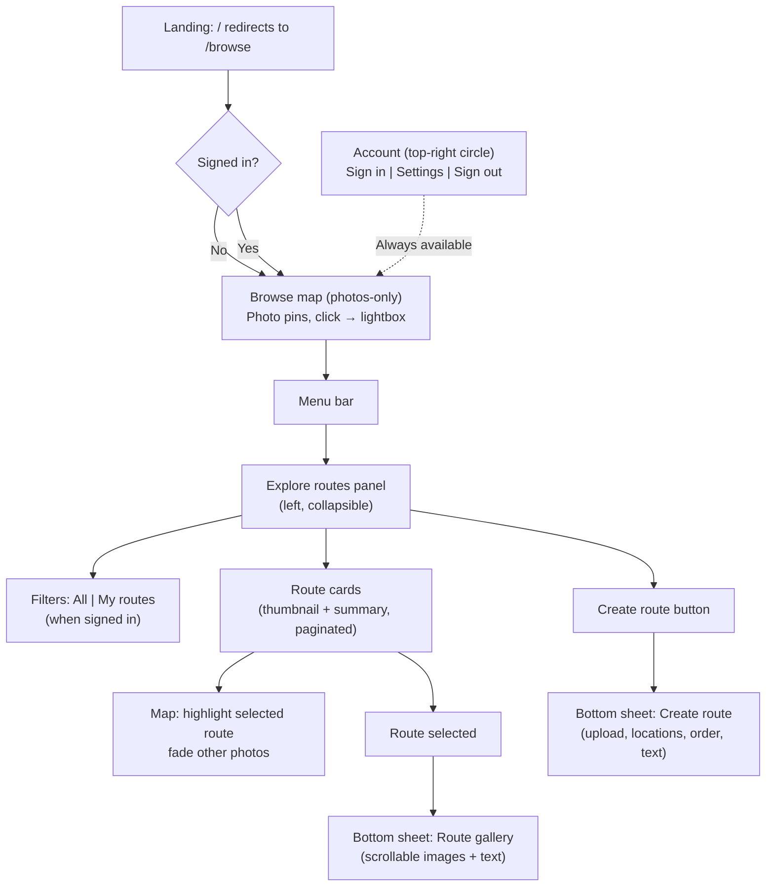

# Photowalker: Intended User Flows

> **Superseded by [PRD.md](./PRD.md)** — User flows are now consolidated in the PRD. This document is retained for historical context.

---

## 1. Purpose and inspiration

This document defines the intended user flows for the Photowalker UI overhaul. It is informed by:

- **Google Maps:** Collapsible left sidebar for lists; list items with thumbnails and summaries; hover/select synced to the map (highlight one, fade the rest); category chips; top-right account icon.
- **Apple Maps:** Guides-style left panel; card-based list with search in panel; clean typography; layout that works well with bottom sheets and mobile.

Design aims: map-first experience, clear separation between browsing photos and exploring routes, and UI patterns that can later be adapted to mobile without reworking the flow.

---

## 2. Design principles

- **Map-first:** The map is the primary surface; overlays and panels support it.
- **Collapsible panels for lists:** Route lists live in a left collapsible panel (Explore routes), not as the default view.
- **Bottom drawer for rich content:** Viewing a route and creating a route use the same bottom-drawer pattern (scrollable gallery or form under the map).
- **Top-right account:** Identity and settings live behind a circular user icon in the top-right; no navigation to My routes or Create route from account.
- **Mobile-ready design:** Components and layout should be structured so they can later be converted to mobile (e.g. panel → full-width overlay or bottom sheet, touch-friendly targets) without redefining the flows.

---

## 3. Confirmed clarifications

- **Landing:** Redirect `/` to `/browse`. Welcome popup is shown on the browse page when the user is not signed in.
- **Browse default:** The default browse view is **photos-only** on the map (photo pins; click opens lightbox). Access to **routes** is via the **menu bar** (e.g. "Explore routes" opens the left panel), not the default view.
- **Explore routes:** A left collapsible panel, opened from the menu bar. It contains:
  - **My routes** as a **filter** (e.g. "All" | "My routes" when signed in), not in the account menu.
  - **Create route** as a **button in this panel** only; its own flow, not under account.
- **Account and admin:** Top-right circular user icon. Menu contains **Sign in** (if guest), **Settings**, **Sign out** only — no My routes, no Create route.

---

## 4. Core user flows

### 4.1 Summary table

| Flow | Intention | Refinement | Justification |
|------|-----------|------------|---------------|
| **First impression** | Open directly to browse; welcome popup if not signed in | Redirect `/` to `/browse`. Show welcome on browse as a dismissible modal when unauthenticated. | Single landing surface. |
| **Welcome popup** | Describe app; encourage browse or create account | Copy: "Browse the map" and "Create account" as primary CTAs. Optionally "Maybe later" to dismiss. | Reduces friction. |
| **Create account** | Redirect to Google auth | Unchanged. Post-login redirect returns to browse or intended page. | Existing auth flow. |
| **Browse map** | Browse photos on map (current location); click photo → lightbox with title, user, routes | Default browse = **photos-only**. Map shows photo pins in viewport (centred on user location); click opens lightbox (title, user, routes containing photo). Routes are reached via menu bar → Explore routes. | Photo-first landing; routes are a separate mode. |
| **Explore routes** | Left collapsible panel; route cards (thumbnail + summary); paginated; hover/select → map highlights that route’s photos and fades the rest | Opened from **menu bar**. Panel: filter "My routes" (when signed in), "Create route" button, collapse to icon strip, search bar, sort/filter chips. | My routes as filter; Create route from panel. |
| **Viewing a route** | Route expands under the map; user scrolls to see gallery (images + text); default sequential | Bottom sheet/drawer under the map. Peek state + expanded scrollable gallery + text. Default: sequential gallery. | Same drawer pattern as create. |
| **Creating a route** | Button in Explore routes panel; drawer from under map; upload photos, confirm locations, adjust route, add text | Trigger only from **Explore routes panel** ("Create route" button). Same bottom drawer as route view. Steps: upload → confirm locations → adjust order/route → add title/description. | Separate flow from panel; consistent drawer. |
| **Account and admin** | Login and admin from top-right, circular user icon | Top-right user circle only. Dropdown: Sign in (if guest), Settings, Sign out. No My routes or Create route. | Account = identity and settings only. |

### 4.2 Narrative

**First impression:** The app opens at `/browse` (root redirects to browse). If the user is not signed in, a dismissible welcome popup appears on the browse page, describing the app and offering "Browse the map" and "Create account" (and optionally "Maybe later").

**Browse map:** By default the map shows **photo pins** only, centred around the user’s location. Clicking a photo opens a lightbox with the photo’s title, user, and routes it belongs to. The **Explore routes** experience (route list and filters) is not the default; it is opened from the **menu bar** (e.g. "Explore routes").

**Explore routes:** The menu bar opens a **left collapsible panel** with a paginated list of route cards (thumbnail + summary). When signed in, a **My routes** filter is available (e.g. "All" | "My routes"). A **Create route** button in the panel starts the create flow. Hover or select a route card to highlight that route’s photos on the map and fade the rest. The panel can collapse to an icon strip.

**Viewing a route:** Selecting a route (e.g. from the panel or map) opens a **bottom drawer** under the map. The user can scroll to see the gallery (images and text) in sequence; default is sequential order.

**Creating a route:** The only entry point is the **Create route** button in the Explore routes panel. This opens the same style of bottom drawer as route view. The flow: upload photos, confirm locations (map picker), adjust route order, add title/description.

**Account:** A **circular user icon** in the **top-right** opens a dropdown with Sign in (if guest), Settings, and Sign out. My routes and Create route are not in this menu.

---

## 5. Additional user flows (suggested for later)

The following are **not** in the current scope but are suggested for a later phase:

- **Filter/sort routes (in Explore panel):** Chips or dropdown: "Newest", "Nearest to me", "By tag". Improves discoverability without leaving the panel.
- **Search within Explore:** Search bar in the left panel for route name/description (and optionally tag). Aligns with Google/Apple search-in-panel pattern.
- **Share route:** From the route gallery (bottom sheet), a "Share" button (copy link or native share). Supports engagement and growth.
- **Save/bookmark route:** "Save" on a route card or in the gallery; could surface as a filter in Explore routes (e.g. "Saved") when signed in. Supports retention; keeps Explore as the single place for route discovery and filters.
- **Offline:** Download route and map area for offline use. Relevant for future mobile use in areas with poor connectivity.

---

## 6. Mobile: design for easy conversion

Mobile-specific behaviour is **not** in the current implementation scope. The current UI should be **designed so that** it can be converted to mobile later without redefining flows:

- **Left panel (Explore routes):** Structure and state so that on narrow viewports the panel can become a full-width overlay or bottom sheet when opened, and collapse to an icon or hide when closed.
- **Bottom drawer (route view / create):** Use a single drawer component with a clear peek state and expand state; avoid fixed heights that would prevent a future drag handle and full-height expand on small screens.
- **Touch:** Prefer tap/select semantics for "highlight this route on map" so that hover can be mapped to tap/selection on touch devices; ensure route cards and photo pins have adequate hit targets for touch.
- **Map and account:** Keep zoom/compass and the top-right account icon in the same conceptual positions so they can remain reachable on mobile.

---

## 7. Flow diagram

---

## 8. Open / technical notes

- **Photo-level browse:** Default browse is photos on the map. This requires a photo-level map (photo pins in viewport) and likely an API or data shape that supports photos-in-bbox (or equivalent) for the current view.
- **Route highlight on map:** When a route is hovered/selected in the Explore panel, the map should show that route’s photos highlighted and others faded; implementation will need a single map state that can switch between "all photos" and "route-focused" views.
- **Shared drawer component:** View route and Create route should share the same bottom-drawer component for consistency and to simplify future mobile conversion.
